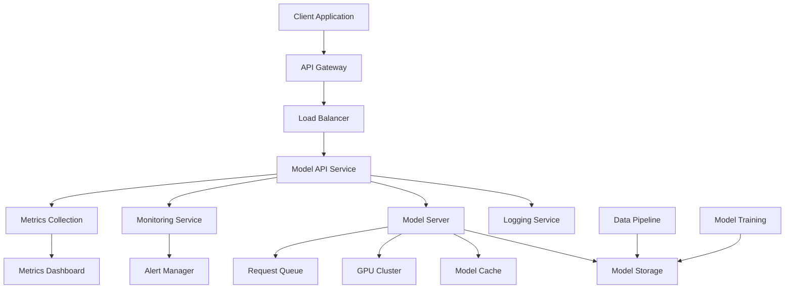

# AI Model Integration: {{model_type}} for {{application_type}}

**Deployment:** {{deployment_environment}}  
**Performance:** {{performance_requirements}}  
**Model Source:** {{model_source}}  
**Expected Load:** {{expected_load}}

## 1. Architecture Design

### High-Level System Architecture


### Component Specifications
```yaml
architecture:
  api_gateway:
    purpose: "Request routing, authentication, rate limiting"
    technology: "Kong, AWS API Gateway, or Nginx"
    scaling: "Auto-scaling based on request volume"
    
  model_server:
    purpose: "Model inference execution"
    technology: "{{#if (eq model_type 'llm')}}vLLM, TensorRT-LLM{{else if (eq model_type 'computer-vision')}}TensorRT, ONNX Runtime{{else}}TensorFlow Serving, TorchServe{{/if}}"
    scaling: "Horizontal scaling with GPU clusters"
    
  model_cache:
    purpose: "Caching frequent predictions and model artifacts"
    technology: "Redis, Memcached"
    policy: "LRU with TTL based on model type"
    
  monitoring:
    purpose: "Performance tracking, error detection, alerting"
    technology: "Prometheus, Grafana, ELK Stack"
    metrics: "Latency, throughput, accuracy, resource usage"
```

## 2. Model Serving Infrastructure

{{#if (eq model_type "llm")}}
### Large Language Model Serving
```python
# LLM serving with vLLM
from vllm import LLM, SamplingParams
from fastapi import FastAPI, HTTPException, BackgroundTasks
from pydantic import BaseModel
import asyncio
import time
from typing import List, Optional

class LLMServer:
    def __init__(self, model_name: str, tensor_parallel_size: int = 1):
        self.model_name = model_name
        self.llm = LLM(
            model=model_name,
            tensor_parallel_size=tensor_parallel_size,
            gpu_memory_utilization=0.95,
            max_model_len=4096,
            enforce_eager=True  # For better performance
        )
        self.default_sampling_params = SamplingParams(
            temperature=0.7,
            top_p=0.9,
            max_tokens=512
        )
    
    async def generate(self, prompts: List[str], sampling_params: Optional[SamplingParams] = None) -> List[str]:
        if sampling_params is None:
            sampling_params = self.default_sampling_params
        
        start_time = time.time()
        outputs = self.llm.generate(prompts, sampling_params)
        inference_time = time.time() - start_time
        
        results = [output.outputs[0].text for output in outputs]
        
        # Log metrics
        await self.log_metrics({
            'inference_time': inference_time,
            'batch_size': len(prompts),
            'tokens_generated': sum(len(result.split()) for result in results)
        })
        
        return results
    
    async def log_metrics(self, metrics: dict):
        # Send metrics to monitoring system
        pass

# FastAPI application
app = FastAPI(title="LLM API Server")
llm_server = LLMServer("{{model_source}}")

class GenerationRequest(BaseModel):
    prompt: str
    max_tokens: Optional[int] = 512
    temperature: Optional[float] = 0.7
    top_p: Optional[float] = 0.9

class BatchGenerationRequest(BaseModel):
    prompts: List[str]
    max_tokens: Optional[int] = 512
    temperature: Optional[float] = 0.7
    top_p: Optional[float] = 0.9

@app.post("/generate")
async def generate_text(request: GenerationRequest):
    try:
        sampling_params = SamplingParams(
            temperature=request.temperature,
            top_p=request.top_p,
            max_tokens=request.max_tokens
        )
        
        results = await llm_server.generate([request.prompt], sampling_params)
        return {"generated_text": results[0]}
        
    except Exception as e:
        raise HTTPException(status_code=500, detail=str(e))

@app.post("/batch_generate")
async def batch_generate_text(request: BatchGenerationRequest):
    try:
        sampling_params = SamplingParams(
            temperature=request.temperature,
            top_p=request.top_p,
            max_tokens=request.max_tokens
        )
        
        results = await llm_server.generate(request.prompts, sampling_params)
        return {"generated_texts": results}
        
    except Exception as e:
        raise HTTPException(status_code=500, detail=str(e))

@app.get("/health")
async def health_check():
    return {"status": "healthy", "model": llm_server.model_name}
```
{{/if}}

{{#if (eq model_type "computer-vision")}}
### Computer Vision Model Serving
```python
# Computer vision model serving with TensorRT optimization
import tensorrt as trt
import pycuda.driver as cuda
import pycuda.autoinit
import numpy as np
from PIL import Image
import cv2
from fastapi import FastAPI, File, UploadFile, HTTPException
from fastapi.responses import JSONResponse
import base64
import io

class ComputerVisionServer:
    def __init__(self, model_path: str, input_shape: tuple):
        self.model_path = model_path
        self.input_shape = input_shape
        self.engine = self.load_engine()
        self.context = self.engine.create_execution_context()
        
        # Allocate GPU memory
        self.inputs, self.outputs, self.bindings, self.stream = self.allocate_buffers()
    
    def load_engine(self):
        """Load TensorRT engine from file"""
        with open(self.model_path, 'rb') as f, trt.Runtime(trt.Logger(trt.Logger.WARNING)) as runtime:
            return runtime.deserialize_cuda_engine(f.read())
    
    def allocate_buffers(self):
        """Allocate GPU memory for inputs and outputs"""
        inputs = []
        outputs = []
        bindings = []
        stream = cuda.Stream()
        
        for binding in self.engine:
            size = trt.volume(self.engine.get_binding_shape(binding)) * self.engine.max_batch_size
            dtype = trt.nptype(self.engine.get_binding_dtype(binding))
            
            # Allocate host and device buffers
            host_mem = cuda.pagelocked_empty(size, dtype)
            device_mem = cuda.mem_alloc(host_mem.nbytes)
            bindings.append(int(device_mem))
            
            if self.engine.binding_is_input(binding):
                inputs.append({'host': host_mem, 'device': device_mem})
            else:
                outputs.append({'host': host_mem, 'device': device_mem})
        
        return inputs, outputs, bindings, stream
    
    def preprocess_image(self, image: Image.Image) -> np.ndarray:
        """Preprocess image for model input"""
        # Resize and normalize based on model requirements
        image = image.resize(self.input_shape[:2])
        image_array = np.array(image).astype(np.float32)
        
        # Normalize (adjust based on your model's training)
        image_array = (image_array / 255.0 - 0.5) / 0.5
        
        # Add batch dimension and change channel order if needed
        if len(image_array.shape) == 3:
            image_array = np.transpose(image_array, (2, 0, 1))  # HWC to CHW
        image_array = np.expand_dims(image_array, axis=0)  # Add batch dimension
        
        return image_array
    
    async def predict(self, image: Image.Image) -> dict:
        """Run inference on image"""
        start_time = time.time()
        
        # Preprocess
        input_data = self.preprocess_image(image)
        
        # Copy input data to GPU
        np.copyto(self.inputs[0]['host'], input_data.ravel())
        cuda.memcpy_htod_async(self.inputs[0]['device'], self.inputs[0]['host'], self.stream)
        
        # Run inference
        self.context.execute_async_v2(bindings=self.bindings, stream_handle=self.stream.handle)
        
        # Copy output back to host
        cuda.memcpy_dtoh_async(self.outputs[0]['host'], self.outputs[0]['device'], self.stream)
        self.stream.synchronize()
        
        # Process output
        output = self.outputs[0]['host'].reshape((-1,))  # Adjust based on your model
        predictions = self.postprocess_output(output)
        
        inference_time = time.time() - start_time
        
        return {
            'predictions': predictions,
            'inference_time': inference_time
        }
    
    def postprocess_output(self, output: np.ndarray) -> dict:
        """Postprocess model output to human-readable format"""
        # This depends on your specific model (classification, detection, etc.)
        if len(output) == 1000:  # ImageNet classification example
            class_idx = np.argmax(output)
            confidence = float(np.max(output))
            return {
                'class_id': int(class_idx),
                'confidence': confidence
            }
        else:
            # Generic output
            return {'raw_output': output.tolist()}

# FastAPI application
app = FastAPI(title="Computer Vision API")
cv_server = ComputerVisionServer("model.trt", (224, 224, 3))

@app.post("/predict")
async def predict_image(file: UploadFile = File(...)):
    try:
        # Read and process image
        image_data = await file.read()
        image = Image.open(io.BytesIO(image_data))
        
        # Run prediction
        result = await cv_server.predict(image)
        
        return JSONResponse(content=result)
        
    except Exception as e:
        raise HTTPException(status_code=500, detail=str(e))

@app.post("/predict_base64")
async def predict_base64_image(image_data: dict):
    try:
        # Decode base64 image
        image_bytes = base64.b64decode(image_data['image'])
        image = Image.open(io.BytesIO(image_bytes))
        
        # Run prediction
        result = await cv_server.predict(image)
        
        return JSONResponse(content=result)
        
    except Exception as e:
        raise HTTPException(status_code=500, detail=str(e))
```
{{/if}}

{{#if (eq model_type "nlp")}}
### NLP Model Serving
```python
# NLP model serving with Transformers and optimizations
from transformers import AutoTokenizer, AutoModel, pipeline
from optimum.onnxruntime import ORTModelForSequenceClassification
import torch
from fastapi import FastAPI, HTTPException
from pydantic import BaseModel
from typing import List, Dict, Optional
import asyncio
import time

class NLPServer:
    def __init__(self, model_name: str, task_type: str = "classification"):
        self.model_name = model_name
        self.task_type = task_type
        self.device = "cuda" if torch.cuda.is_available() else "cpu"
        
        # Load tokenizer
        self.tokenizer = AutoTokenizer.from_pretrained(model_name)
        
        # Load optimized model if available
        try:
            self.model = ORTModelForSequenceClassification.from_pretrained(
                model_name, 
                export=True,
                provider="CUDAExecutionProvider" if self.device == "cuda" else "CPUExecutionProvider"
            )
        except:
            self.model = AutoModel.from_pretrained(model_name)
            self.model.to(self.device)
        
        # Create pipeline for common tasks
        if task_type in ["classification", "sentiment-analysis"]:
            self.pipeline = pipeline(
                "text-classification",
                model=self.model,
                tokenizer=self.tokenizer,
                device=0 if self.device == "cuda" else -1
            )
        elif task_type == "named-entity-recognition":
            self.pipeline = pipeline(
                "ner",
                model=self.model,
                tokenizer=self.tokenizer,
                device=0 if self.device == "cuda" else -1,
                aggregation_strategy="simple"
            )
        elif task_type == "question-answering":
            self.pipeline = pipeline(
                "question-answering",
                model=self.model,
                tokenizer=self.tokenizer,
                device=0 if self.device == "cuda" else -1
            )
    
    async def process_text(self, texts: List[str], **kwargs) -> List[Dict]:
        """Process text inputs through the model"""
        start_time = time.time()
        
        try:
            # Run inference
            if isinstance(texts, str):
                texts = [texts]
            
            results = self.pipeline(texts, **kwargs)
            
            # Ensure results is a list
            if not isinstance(results, list):
                results = [results]
            
            inference_time = time.time() - start_time
            
            # Log metrics
            await self.log_metrics({
                'inference_time': inference_time,
                'batch_size': len(texts),
                'avg_text_length': sum(len(text) for text in texts) / len(texts)
            })
            
            return results
            
        except Exception as e:
            raise Exception(f"Model inference failed: {str(e)}")
    
    async def log_metrics(self, metrics: Dict):
        """Log performance metrics"""
        # Implementation depends on your monitoring setup
        pass

# FastAPI application
app = FastAPI(title="NLP API Server")
nlp_server = NLPServer("{{model_source}}", "{{task_type}}")

class TextRequest(BaseModel):
    text: str
    options: Optional[Dict] = {}

class BatchTextRequest(BaseModel):
    texts: List[str]
    options: Optional[Dict] = {}

class QARequest(BaseModel):
    question: str
    context: str
    options: Optional[Dict] = {}

@app.post("/process")
async def process_text(request: TextRequest):
    try:
        results = await nlp_server.process_text([request.text], **request.options)
        return {"result": results[0]}
    except Exception as e:
        raise HTTPException(status_code=500, detail=str(e))

@app.post("/batch_process")
async def batch_process_text(request: BatchTextRequest):
    try:
        results = await nlp_server.process_text(request.texts, **request.options)
        return {"results": results}
    except Exception as e:
        raise HTTPException(status_code=500, detail=str(e))

@app.post("/question_answering")
async def answer_question(request: QARequest):
    try:
        qa_input = {"question": request.question, "context": request.context}
        results = await nlp_server.process_text([qa_input], **request.options)
        return {"answer": results[0]}
    except Exception as e:
        raise HTTPException(status_code=500, detail=str(e))
```
{{/if}}

## 3. Deployment Configuration

### Docker Configuration
```dockerfile
# Dockerfile for {{model_type}} model serving
{{#if (eq model_type "llm")}}
FROM nvidia/cuda:12.1-devel-ubuntu20.04

# Install Python and dependencies
RUN apt-get update && apt-get install -y \
    python3 python3-pip \
    && rm -rf /var/lib/apt/lists/*

# Install vLLM and dependencies
RUN pip install vllm fastapi uvicorn[standard] \
    prometheus-client pydantic
{{/if}}

{{#if (eq model_type "computer-vision")}}
FROM nvcr.io/nvidia/tensorrt:23.08-py3

# Install additional dependencies
RUN pip install fastapi uvicorn[standard] pillow opencv-python \
    pycuda prometheus-client
{{/if}}

{{#if (eq model_type "nlp")}}
FROM pytorch/pytorch:2.1.0-cuda12.1-cudnn8-runtime

# Install transformers and optimum
RUN pip install transformers optimum[onnxruntime-gpu] \
    fastapi uvicorn[standard] prometheus-client
{{/if}}

# Copy application code
COPY . /app
WORKDIR /app

# Download model (if not using model mounting)
{{#if (eq model_source "custom-trained")}}
COPY models/ /app/models/
{{else}}
RUN python download_model.py
{{/if}}

# Expose port
EXPOSE 8000

# Health check
HEALTHCHECK --interval=30s --timeout=30s --start-period=60s --retries=3 \
    CMD curl -f http://localhost:8000/health || exit 1

# Run the application
CMD ["uvicorn", "main:app", "--host", "0.0.0.0", "--port", "8000", "--workers", "1"]
```

### Kubernetes Deployment
```yaml
# k8s-deployment.yaml
apiVersion: apps/v1
kind: Deployment
metadata:
  name: {{model_type}}-model-server
  labels:
    app: {{model_type}}-model
spec:
  replicas: {{#if (eq expected_load "high")}}5{{else if (eq expected_load "medium")}}3{{else}}2{{/if}}
  selector:
    matchLabels:
      app: {{model_type}}-model
  template:
    metadata:
      labels:
        app: {{model_type}}-model
    spec:
      containers:
      - name: model-server
        image: {{model_type}}-server:latest
        ports:
        - containerPort: 8000
        env:
        - name: MODEL_NAME
          value: "{{model_source}}"
        - name: CUDA_VISIBLE_DEVICES
          value: "0"
        resources:
          requests:
            memory: "{{#if (eq model_type 'llm')}}16Gi{{else if (eq model_type 'computer-vision')}}8Gi{{else}}4Gi{{/if}}"
            cpu: "{{#if (eq performance_requirements 'low-latency')}}4{{else}}2{{/if}}"
            nvidia.com/gpu: 1
          limits:
            memory: "{{#if (eq model_type 'llm')}}32Gi{{else if (eq model_type 'computer-vision')}}16Gi{{else}}8Gi{{/if}}"
            cpu: "{{#if (eq performance_requirements 'low-latency')}}8{{else}}4{{/if}}"
            nvidia.com/gpu: 1
        volumeMounts:
        - name: model-storage
          mountPath: /app/models
        livenessProbe:
          httpGet:
            path: /health
            port: 8000
          initialDelaySeconds: 60
          periodSeconds: 30
        readinessProbe:
          httpGet:
            path: /health
            port: 8000
          initialDelaySeconds: 30
          periodSeconds: 10
      volumes:
      - name: model-storage
        persistentVolumeClaim:
          claimName: model-storage-pvc
      nodeSelector:
        accelerator: nvidia-tesla-gpu
---
apiVersion: v1
kind: Service
metadata:
  name: {{model_type}}-model-service
spec:
  selector:
    app: {{model_type}}-model
  ports:
  - protocol: TCP
    port: 80
    targetPort: 8000
  type: ClusterIP
---
apiVersion: autoscaling/v2
kind: HorizontalPodAutoscaler
metadata:
  name: {{model_type}}-model-hpa
spec:
  scaleTargetRef:
    apiVersion: apps/v1
    kind: Deployment
    name: {{model_type}}-model-server
  minReplicas: {{#if (eq expected_load "high")}}3{{else if (eq expected_load "medium")}}2{{else}}1{{/if}}
  maxReplicas: {{#if (eq expected_load "high")}}20{{else if (eq expected_load "medium")}}10{{else}}5{{/if}}
  metrics:
  - type: Resource
    resource:
      name: cpu
      target:
        type: Utilization
        averageUtilization: 70
  - type: Resource
    resource:
      name: memory
      target:
        type: Utilization
        averageUtilization: 80
```

## 4. Performance Optimization

### Model Optimization Strategies
```python
# Model optimization pipeline
class ModelOptimizer:
    def __init__(self, model_path: str, optimization_level: str = "balanced"):
        self.model_path = model_path
        self.optimization_level = optimization_level
    
    def optimize_for_inference(self):
        """Apply various optimization techniques"""
        optimizations = []
        
        {{#if (eq model_type "llm")}}
        # LLM-specific optimizations
        if self.optimization_level in ["performance", "balanced"]:
            optimizations.extend([
                self.apply_quantization,
                self.optimize_attention,
                self.apply_kv_cache_optimization
            ])
        
        if self.optimization_level == "performance":
            optimizations.extend([
                self.apply_tensor_parallelism,
                self.optimize_memory_layout
            ])
        {{/if}}
        
        {{#if (eq model_type "computer-vision")}}
        # Computer vision optimizations
        if self.optimization_level in ["performance", "balanced"]:
            optimizations.extend([
                self.convert_to_tensorrt,
                self.optimize_batch_processing,
                self.apply_pruning
            ])
        {{/if}}
        
        {{#if (eq model_type "nlp")}}
        # NLP model optimizations
        if self.optimization_level in ["performance", "balanced"]:
            optimizations.extend([
                self.convert_to_onnx,
                self.apply_dynamic_quantization,
                self.optimize_tokenization
            ])
        {{/if}}
        
        # Apply optimizations
        for optimization in optimizations:
            try:
                optimization()
                print(f"Applied {optimization.__name__}")
            except Exception as e:
                print(f"Failed to apply {optimization.__name__}: {e}")
    
    {{#if (eq model_type "llm")}}
    def apply_quantization(self):
        """Apply INT8 or INT4 quantization"""
        from transformers import BitsAndBytesConfig
        
        quantization_config = BitsAndBytesConfig(
            load_in_4bit=True,
            bnb_4bit_compute_dtype=torch.float16,
            bnb_4bit_use_double_quant=True,
            bnb_4bit_quant_type="nf4"
        )
        
        # Apply quantization (implementation depends on model library)
        pass
    
    def optimize_attention(self):
        """Optimize attention mechanisms"""
        # Flash Attention optimization
        pass
    
    def apply_kv_cache_optimization(self):
        """Optimize key-value cache for transformer models"""
        pass
    {{/if}}
    
    {{#if (eq model_type "computer-vision")}}
    def convert_to_tensorrt(self):
        """Convert model to TensorRT for GPU optimization"""
        import tensorrt as trt
        
        # TensorRT conversion logic
        pass
    
    def optimize_batch_processing(self):
        """Optimize for batch inference"""
        pass
    
    def apply_pruning(self):
        """Apply structured or unstructured pruning"""
        pass
    {{/if}}
    
    {{#if (eq model_type "nlp")}}
    def convert_to_onnx(self):
        """Convert model to ONNX format"""
        from optimum.onnxruntime import ORTOptimizer, ORTQuantizer
        from optimum.onnxruntime.configuration import OptimizationConfig, AutoQuantizationConfig
        
        # ONNX conversion and optimization
        pass
    
    def apply_dynamic_quantization(self):
        """Apply dynamic quantization"""
        pass
    
    def optimize_tokenization(self):
        """Optimize tokenization process"""
        pass
    {{/if}}

# Caching layer for frequent requests
class ModelCache:
    def __init__(self, cache_type: str = "redis"):
        if cache_type == "redis":
            import redis
            self.cache = redis.Redis(host='localhost', port=6379, db=0)
        else:
            self.cache = {}
    
    def get_cache_key(self, input_data: str, model_params: dict) -> str:
        """Generate cache key for input"""
        import hashlib
        key_string = f"{input_data}_{str(model_params)}"
        return hashlib.md5(key_string.encode()).hexdigest()
    
    async def get_cached_result(self, cache_key: str):
        """Get cached prediction result"""
        if hasattr(self.cache, 'get'):
            result = self.cache.get(cache_key)
            if result:
                import json
                return json.loads(result)
        else:
            return self.cache.get(cache_key)
        return None
    
    async def cache_result(self, cache_key: str, result: dict, ttl: int = 3600):
        """Cache prediction result"""
        import json
        if hasattr(self.cache, 'setex'):
            self.cache.setex(cache_key, ttl, json.dumps(result))
        else:
            self.cache[cache_key] = result
```

## 5. Monitoring & Observability

### Comprehensive Monitoring Setup
```python
# Monitoring and metrics collection
from prometheus_client import Counter, Histogram, Gauge, start_http_server
import time
import psutil
import GPUtil
from functools import wraps

# Prometheus metrics
REQUEST_COUNT = Counter('model_requests_total', 'Total model requests', ['method', 'endpoint', 'status'])
REQUEST_LATENCY = Histogram('model_request_duration_seconds', 'Request latency')
MODEL_LOAD_TIME = Histogram('model_load_duration_seconds', 'Model loading time')
ACTIVE_CONNECTIONS = Gauge('model_active_connections', 'Active connections')
GPU_UTILIZATION = Gauge('gpu_utilization_percent', 'GPU utilization percentage')
GPU_MEMORY = Gauge('gpu_memory_used_mb', 'GPU memory usage in MB')
CPU_USAGE = Gauge('cpu_usage_percent', 'CPU usage percentage')
RAM_USAGE = Gauge('ram_usage_mb', 'RAM usage in MB')

class ModelMonitor:
    def __init__(self):
        self.start_time = time.time()
        self.request_count = 0
        
        # Start Prometheus metrics server
        start_http_server(8001)
        
        # Start system monitoring
        self.start_system_monitoring()
    
    def monitor_request(self, func):
        """Decorator to monitor API requests"""
        @wraps(func)
        async def wrapper(*args, **kwargs):
            start_time = time.time()
            status = "success"
            
            try:
                result = await func(*args, **kwargs)
                return result
            except Exception as e:
                status = "error"
                raise
            finally:
                # Record metrics
                REQUEST_COUNT.labels(
                    method="POST",
                    endpoint=func.__name__,
                    status=status
                ).inc()
                
                REQUEST_LATENCY.observe(time.time() - start_time)
                self.request_count += 1
        
        return wrapper
    
    def start_system_monitoring(self):
        """Start background system monitoring"""
        import threading
        import time
        
        def monitor_system():
            while True:
                try:
                    # CPU and RAM monitoring
                    CPU_USAGE.set(psutil.cpu_percent())
                    RAM_USAGE.set(psutil.virtual_memory().used / 1024 / 1024)
                    
                    # GPU monitoring
                    gpus = GPUtil.getGPUs()
                    if gpus:
                        gpu = gpus[0]
                        GPU_UTILIZATION.set(gpu.load * 100)
                        GPU_MEMORY.set(gpu.memoryUsed)
                    
                    time.sleep(10)  # Update every 10 seconds
                except Exception as e:
                    print(f"Monitoring error: {e}")
        
        monitor_thread = threading.Thread(target=monitor_system, daemon=True)
        monitor_thread.start()
    
    def get_health_status(self) -> dict:
        """Get comprehensive health status"""
        return {
            "status": "healthy",
            "uptime_seconds": time.time() - self.start_time,
            "total_requests": self.request_count,
            "system": {
                "cpu_percent": psutil.cpu_percent(),
                "memory_percent": psutil.virtual_memory().percent,
                "disk_percent": psutil.disk_usage('/').percent
            },
            "gpu": self.get_gpu_status(),
            "model": {
                "loaded": True,
                "version": "{{model_source}}",
                "type": "{{model_type}}"
            }
        }
    
    def get_gpu_status(self) -> dict:
        """Get GPU status information"""
        try:
            gpus = GPUtil.getGPUs()
            if gpus:
                gpu = gpus[0]
                return {
                    "available": True,
                    "utilization_percent": gpu.load * 100,
                    "memory_used_mb": gpu.memoryUsed,
                    "memory_total_mb": gpu.memoryTotal,
                    "temperature_c": gpu.temperature
                }
        except:
            pass
        
        return {"available": False}

# Initialize monitor
monitor = ModelMonitor()

# Add monitoring to API endpoints
@app.middleware("http")
async def monitor_requests(request, call_next):
    start_time = time.time()
    
    response = await call_next(request)
    
    # Log request metrics
    REQUEST_LATENCY.observe(time.time() - start_time)
    REQUEST_COUNT.labels(
        method=request.method,
        endpoint=request.url.path,
        status=response.status_code
    ).inc()
    
    return response

@app.get("/metrics")
async def get_metrics():
    """Prometheus metrics endpoint"""
    from prometheus_client import generate_latest, CONTENT_TYPE_LATEST
    return Response(generate_latest(), media_type=CONTENT_TYPE_LATEST)

@app.get("/health")
async def health_check():
    """Comprehensive health check"""
    return monitor.get_health_status()
```

### Grafana Dashboard Configuration
```json
{
  "dashboard": {
    "title": "{{model_type}} Model API Dashboard",
    "panels": [
      {
        "title": "Request Rate",
        "type": "graph",
        "targets": [{
          "expr": "rate(model_requests_total[5m])",
          "legendFormat": "{{status}}"
        }]
      },
      {
        "title": "Response Latency",
        "type": "graph",
        "targets": [{
          "expr": "histogram_quantile(0.95, rate(model_request_duration_seconds_bucket[5m]))",
          "legendFormat": "95th percentile"
        }, {
          "expr": "histogram_quantile(0.50, rate(model_request_duration_seconds_bucket[5m]))",
          "legendFormat": "50th percentile"
        }]
      },
      {
        "title": "GPU Utilization",
        "type": "graph",
        "targets": [{
          "expr": "gpu_utilization_percent",
          "legendFormat": "GPU Utilization %"
        }]
      },
      {
        "title": "Memory Usage",
        "type": "graph",
        "targets": [{
          "expr": "gpu_memory_used_mb",
          "legendFormat": "GPU Memory MB"
        }, {
          "expr": "ram_usage_mb",
          "legendFormat": "System RAM MB"
        }]
      },
      {
        "title": "Error Rate",
        "type": "singlestat",
        "targets": [{
          "expr": "rate(model_requests_total{status=\"error\"}[5m]) / rate(model_requests_total[5m]) * 100"
        }]
      }
    ]
  }
}
```

## 6. Security & Access Control

### API Security Implementation
```python
# API security and access control
from fastapi import HTTPException, Depends, status
from fastapi.security import HTTPBearer, HTTPAuthorizationCredentials
import jwt
import time
from typing import Optional

security = HTTPBearer()

class APIKeyAuth:
    def __init__(self, valid_api_keys: set):
        self.valid_api_keys = valid_api_keys
    
    async def __call__(self, credentials: HTTPAuthorizationCredentials = Depends(security)):
        if credentials.credentials not in self.valid_api_keys:
            raise HTTPException(
                status_code=status.HTTP_401_UNAUTHORIZED,
                detail="Invalid API key"
            )
        return credentials.credentials

class JWTAuth:
    def __init__(self, secret_key: str, algorithm: str = "HS256"):
        self.secret_key = secret_key
        self.algorithm = algorithm
    
    async def __call__(self, credentials: HTTPAuthorizationCredentials = Depends(security)):
        try:
            payload = jwt.decode(
                credentials.credentials,
                self.secret_key,
                algorithms=[self.algorithm]
            )
            
            # Check expiration
            if payload.get("exp", 0) < time.time():
                raise HTTPException(
                    status_code=status.HTTP_401_UNAUTHORIZED,
                    detail="Token expired"
                )
            
            return payload
            
        except jwt.InvalidTokenError:
            raise HTTPException(
                status_code=status.HTTP_401_UNAUTHORIZED,
                detail="Invalid token"
            )

# Rate limiting
from slowapi import Limiter, _rate_limit_exceeded_handler
from slowapi.util import get_remote_address
from slowapi.errors import RateLimitExceeded

limiter = Limiter(key_func=get_remote_address)
app.state.limiter = limiter
app.add_exception_handler(RateLimitExceeded, _rate_limit_exceeded_handler)

# Input validation and sanitization
from pydantic import BaseModel, validator
import re

class SecureTextRequest(BaseModel):
    text: str
    
    @validator('text')
    def validate_text(cls, v):
        # Basic input sanitization
        if len(v) > 10000:  # Limit input size
            raise ValueError('Text too long')
        
        # Remove potentially harmful characters
        sanitized = re.sub(r'[<>"\']', '', v)
        return sanitized.strip()

# Secure endpoints with authentication and rate limiting
@app.post("/secure_generate")
@limiter.limit("{{#if (eq expected_load 'high')}}1000/minute{{else if (eq expected_load 'medium')}}100/minute{{else}}10/minute{{/if}}")
async def secure_generate(
    request: Request,
    text_request: SecureTextRequest,
    api_key: str = Depends(APIKeyAuth({"your-api-key-here"}))
):
    try:
        # Process request securely
        result = await model_server.process_text([text_request.text])
        return {"result": result[0]}
    except Exception as e:
        raise HTTPException(status_code=500, detail="Processing failed")
```

## 7. Error Handling & Fallback Strategies

### Robust Error Handling
```python
# Comprehensive error handling and fallback mechanisms
from enum import Enum
import logging
from typing import Union, Optional

class ErrorType(Enum):
    INPUT_VALIDATION = "input_validation"
    MODEL_INFERENCE = "model_inference"
    RESOURCE_EXHAUSTION = "resource_exhaustion"
    TIMEOUT = "timeout"
    SYSTEM_ERROR = "system_error"

class ModelError(Exception):
    def __init__(self, error_type: ErrorType, message: str, details: Optional[dict] = None):
        self.error_type = error_type
        self.message = message
        self.details = details or {}
        super().__init__(self.message)

class FallbackStrategy:
    def __init__(self):
        self.fallback_models = [
            # List of fallback models or services
        ]
        self.cache = ModelCache()
    
    async def handle_error(self, error: ModelError, original_request: dict) -> dict:
        """Handle errors with appropriate fallback strategies"""
        
        if error.error_type == ErrorType.TIMEOUT:
            # Try cached result first
            cached_result = await self.get_cached_fallback(original_request)
            if cached_result:
                return cached_result
            
            # Try simpler/faster model
            return await self.try_fallback_model(original_request)
        
        elif error.error_type == ErrorType.RESOURCE_EXHAUSTION:
            # Queue for later processing
            await self.queue_for_later(original_request)
            return {"status": "queued", "message": "Request queued for processing"}
        
        elif error.error_type == ErrorType.MODEL_INFERENCE:
            # Try alternative model or return error
            try:
                return await self.try_fallback_model(original_request)
            except:
                return {"error": "Model inference failed", "fallback_attempted": True}
        
        else:
            # Generic error response
            return {"error": error.message, "type": error.error_type.value}
    
    async def get_cached_fallback(self, request: dict) -> Optional[dict]:
        """Try to get similar cached result"""
        # Implementation depends on your caching strategy
        return None
    
    async def try_fallback_model(self, request: dict) -> dict:
        """Try fallback model or service"""
        # Implementation depends on your fallback models
        raise NotImplementedError("Fallback model not implemented")
    
    async def queue_for_later(self, request: dict):
        """Queue request for later processing"""
        # Implementation depends on your queuing system
        pass

# Error handling middleware
@app.exception_handler(ModelError)
async def model_error_handler(request, exc: ModelError):
    logging.error(f"Model error: {exc.error_type.value} - {exc.message}", extra=exc.details)
    
    fallback = FallbackStrategy()
    result = await fallback.handle_error(exc, {"request": request})
    
    return JSONResponse(
        status_code=500 if "error" in result else 200,
        content=result
    )

@app.exception_handler(Exception)
async def general_exception_handler(request, exc: Exception):
    logging.error(f"Unhandled exception: {str(exc)}", exc_info=True)
    
    return JSONResponse(
        status_code=500,
        content={"error": "Internal server error", "request_id": str(uuid.uuid4())}
    )
```

## 8. Testing & Validation

### Comprehensive Testing Suite
```python
# Testing framework for model API
import pytest
import asyncio
import httpx
from unittest.mock import patch, MagicMock
import numpy as np

class TestModelAPI:
    @pytest.fixture
    def client(self):
        from fastapi.testclient import TestClient
        return TestClient(app)
    
    @pytest.fixture
    def sample_input(self):
        {{#if (eq model_type "llm")}}
        return {"prompt": "What is artificial intelligence?"}
        {{/if}}
        {{#if (eq model_type "computer-vision")}}
        # Create sample image data
        import base64
        import io
        from PIL import Image
        
        img = Image.new('RGB', (224, 224), color='red')
        img_bytes = io.BytesIO()
        img.save(img_bytes, format='PNG')
        img_b64 = base64.b64encode(img_bytes.getvalue()).decode()
        
        return {"image": img_b64}
        {{/if}}
        {{#if (eq model_type "nlp")}}
        return {"text": "This is a sample text for testing."}
        {{/if}}
    
    def test_health_endpoint(self, client):
        """Test health check endpoint"""
        response = client.get("/health")
        assert response.status_code == 200
        assert "status" in response.json()
    
    def test_prediction_endpoint(self, client, sample_input):
        """Test main prediction endpoint"""
        {{#if (eq model_type "llm")}}
        response = client.post("/generate", json=sample_input)
        {{/if}}
        {{#if (eq model_type "computer-vision")}}
        response = client.post("/predict_base64", json=sample_input)
        {{/if}}
        {{#if (eq model_type "nlp")}}
        response = client.post("/process", json=sample_input)
        {{/if}}
        
        assert response.status_code == 200
        result = response.json()
        assert "result" in result or "generated_text" in result or "predictions" in result
    
    def test_input_validation(self, client):
        """Test input validation"""
        # Test empty input
        response = client.post("/process", json={})
        assert response.status_code == 422
        
        # Test invalid input
        {{#if (eq model_type "llm")}}
        response = client.post("/generate", json={"prompt": "" * 20000})  # Too long
        {{/if}}
        {{#if (eq model_type "nlp")}}
        response = client.post("/process", json={"text": "" * 20000})  # Too long
        {{/if}}
        assert response.status_code in [400, 422]
    
    def test_error_handling(self, client):
        """Test error handling"""
        with patch('your_model_server.process') as mock_process:
            mock_process.side_effect = Exception("Model error")
            
            {{#if (eq model_type "llm")}}
            response = client.post("/generate", json={"prompt": "test"})
            {{/if}}
            {{#if (eq model_type "nlp")}}
            response = client.post("/process", json={"text": "test"})
            {{/if}}
            
            assert response.status_code == 500
            assert "error" in response.json()
    
    @pytest.mark.asyncio
    async def test_concurrent_requests(self, sample_input):
        """Test handling of concurrent requests"""
        async with httpx.AsyncClient(app=app, base_url="http://test") as client:
            tasks = []
            for _ in range(10):
                {{#if (eq model_type "llm")}}
                task = client.post("/generate", json=sample_input)
                {{/if}}
                {{#if (eq model_type "nlp")}}
                task = client.post("/process", json=sample_input)
                {{/if}}
                tasks.append(task)
            
            responses = await asyncio.gather(*tasks)
            
            for response in responses:
                assert response.status_code == 200
    
    def test_rate_limiting(self, client, sample_input):
        """Test rate limiting"""
        # Make requests rapidly to trigger rate limiting
        responses = []
        for _ in range(20):  # Exceed rate limit
            {{#if (eq model_type "llm")}}
            response = client.post("/secure_generate", 
                                 json=sample_input,
                                 headers={"Authorization": "Bearer your-api-key-here"})
            {{/if}}
            responses.append(response)
        
        # Check that some requests were rate limited
        rate_limited = [r for r in responses if r.status_code == 429]
        assert len(rate_limited) > 0
    
    def test_model_accuracy(self, client):
        """Test model accuracy with known examples"""
        test_cases = [
            # Add your test cases here based on model type
        ]
        
        for input_data, expected_output in test_cases:
            {{#if (eq model_type "llm")}}
            response = client.post("/generate", json={"prompt": input_data})
            {{/if}}
            {{#if (eq model_type "nlp")}}
            response = client.post("/process", json={"text": input_data})
            {{/if}}
            
            assert response.status_code == 200
            result = response.json()
            
            # Add your accuracy validation logic here
            # This depends on your specific model and expected outputs
    
    def test_performance_benchmarks(self, client, sample_input):
        """Test performance benchmarks"""
        import time
        
        # Warm up
        for _ in range(3):
            {{#if (eq model_type "llm")}}
            client.post("/generate", json=sample_input)
            {{/if}}
            {{#if (eq model_type "nlp")}}
            client.post("/process", json=sample_input)
            {{/if}}
        
        # Measure performance
        start_time = time.time()
        
        {{#if (eq model_type "llm")}}
        response = client.post("/generate", json=sample_input)
        {{/if}}
        {{#if (eq model_type "nlp")}}
        response = client.post("/process", json=sample_input)
        {{/if}}
        
        end_time = time.time()
        response_time = end_time - start_time
        
        assert response.status_code == 200
        
        # Performance assertions based on requirements
        {{#if (eq performance_requirements "low-latency")}}
        assert response_time < 1.0  # Less than 1 second
        {{/if}}
        {{#if (eq performance_requirements "high-throughput")}}
        assert response_time < 5.0  # Less than 5 seconds
        {{/if}}

# Load testing
class LoadTest:
    def __init__(self, base_url: str, concurrent_users: int = 10):
        self.base_url = base_url
        self.concurrent_users = concurrent_users
    
    async def run_load_test(self, duration_seconds: int = 60):
        """Run load test for specified duration"""
        import asyncio
        import aiohttp
        import time
        
        results = {
            "total_requests": 0,
            "successful_requests": 0,
            "failed_requests": 0,
            "avg_response_time": 0,
            "max_response_time": 0,
            "min_response_time": float('inf')
        }
        
        async def make_request(session):
            start_time = time.time()
            try:
                async with session.post(
                    f"{self.base_url}/process",
                    json={"text": "Load test sample text"}
                ) as response:
                    await response.json()
                    response_time = time.time() - start_time
                    
                    results["total_requests"] += 1
                    if response.status == 200:
                        results["successful_requests"] += 1
                    else:
                        results["failed_requests"] += 1
                    
                    results["max_response_time"] = max(results["max_response_time"], response_time)
                    results["min_response_time"] = min(results["min_response_time"], response_time)
                    
            except Exception:
                results["total_requests"] += 1
                results["failed_requests"] += 1
        
        start_time = time.time()
        
        async with aiohttp.ClientSession() as session:
            while time.time() - start_time < duration_seconds:
                tasks = [make_request(session) for _ in range(self.concurrent_users)]
                await asyncio.gather(*tasks, return_exceptions=True)
                await asyncio.sleep(0.1)  # Small delay between batches
        
        # Calculate average response time
        if results["successful_requests"] > 0:
            results["avg_response_time"] = (
                results["max_response_time"] + results["min_response_time"]
            ) / 2
        
        return results
```

## Conclusion

This comprehensive AI model integration architecture provides:

**Key Features:**
- Scalable model serving infrastructure
- Performance optimization strategies
- Comprehensive monitoring and observability
- Robust error handling and fallback mechanisms
- Security and access control
- Thorough testing and validation

**Performance Benefits:**
- {{#if (eq performance_requirements "low-latency")}}Sub-second response times{{else if (eq performance_requirements "high-throughput")}}High request throughput{{else if (eq performance_requirements "cost-optimized")}}Cost-effective scaling{{else}}Balanced performance and cost{{/if}}
- Auto-scaling based on demand
- Intelligent caching and optimization
- GPU acceleration for {{model_type}} models

**Deployment Ready:**
- Containerized deployment with Docker/Kubernetes
- {{deployment_environment}} optimized configuration
- Production-grade monitoring and alerting
- Comprehensive testing coverage
- Security hardening and access controls

**Success Metrics:**
- 99.9% uptime target
- {{#if (eq performance_requirements "low-latency")}}< 500ms{{else if (eq performance_requirements "high-throughput")}}> 1000 req/min{{else}}Cost per request < $0.01{{/if}} performance target
- Automatic scaling for {{expected_load}} load
- Zero security incidents
- Model accuracy within acceptable bounds