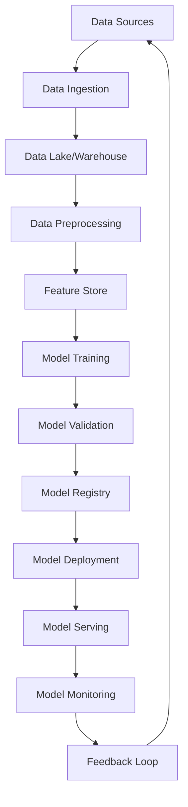

# ML Pipeline Architecture: {{pipeline_type}}

**Data Sources:** {{data_sources}}  
**Model Types:** {{model_types}}  
**Deployment:** {{deployment_target}}  
**Data Volume:** {{data_volume}}  
**Compliance:** {{compliance_requirements}}

## 1. Pipeline Architecture Overview



### Core Components
```yaml
pipeline_components:
  data_ingestion:
    batch: "Apache Airflow, Prefect"
    streaming: "Apache Kafka, AWS Kinesis"
    apis: "Custom connectors, Airbyte"
  
  data_storage:
    lake: "AWS S3, Azure Data Lake, GCS"
    warehouse: "Snowflake, BigQuery, Redshift"
    cache: "Redis, Elasticsearch"
  
  processing:
    batch: "Apache Spark, Dask"
    streaming: "Apache Flink, Kafka Streams"
    feature_engineering: "Feast, Tecton"
  
  training:
    frameworks: "TensorFlow, PyTorch, Scikit-learn"
    orchestration: "Kubeflow, MLflow, Weights & Biases"
    compute: "Kubernetes, AWS SageMaker"
  
  deployment:
    serving: "TensorFlow Serving, TorchServe, Seldon"
    monitoring: "Prometheus, Grafana, MLflow"
    governance: "MLflow Model Registry, DVC"
```

## 2. Data Ingestion Layer

### Batch Data Ingestion
```python
# Apache Airflow DAG for batch data ingestion
from airflow import DAG
from airflow.operators.python_operator import PythonOperator
from airflow.operators.bash_operator import BashOperator
from datetime import datetime, timedelta
import pandas as pd

default_args = {
    'owner': 'ml-team',
    'depends_on_past': False,
    'start_date': datetime(2024, 1, 1),
    'email_on_failure': True,
    'email_on_retry': False,
    'retries': 3,
    'retry_delay': timedelta(minutes=5)
}

def ingest_{{data_sources}}_data(**context):
    """Ingest data from {{data_sources}}"""
    from data_connectors import {{data_sources.replace('-', '_')}}_connector
    
    # Extract data
    extractor = {{data_sources.replace('-', '_')}}_connector.DataExtractor()
    raw_data = extractor.extract_data(
        start_date=context['ds'],
        end_date=context['next_ds']
    )
    
    # Basic validation
    if raw_data.empty:
        raise ValueError("No data extracted for the given date range")
    
    # Store in data lake
    output_path = f"s3://ml-data-lake/raw/{{data_sources}}/{context['ds']}"
    raw_data.to_parquet(output_path, index=False)
    
    return output_path

def validate_data_quality(**context):
    """Validate data quality"""
    import great_expectations as ge
    
    data_path = context['task_instance'].xcom_pull(task_ids='ingest_data')
    df = pd.read_parquet(data_path)
    
    # Create Great Expectations dataset
    ge_df = ge.from_pandas(df)
    
    # Define expectations
    expectations = [
        ge_df.expect_table_row_count_to_be_between(min_value=1000),
        ge_df.expect_column_values_to_not_be_null('id'),
        ge_df.expect_column_values_to_be_unique('id'),
        ge_df.expect_column_values_to_be_between('score', min_value=0, max_value=1)
    ]
    
    # Validate
    for expectation in expectations:
        if not expectation.success:
            raise ValueError(f"Data quality check failed: {expectation}")
    
    return "Data quality validation passed"

dag = DAG(
    'ml_data_ingestion',
    default_args=default_args,
    description='ML Pipeline Data Ingestion',
    schedule_interval='@daily',
    catchup=False
)

ingest_task = PythonOperator(
    task_id='ingest_data',
    python_callable=ingest_{{data_sources}}_data,
    dag=dag
)

validate_task = PythonOperator(
    task_id='validate_data_quality',
    python_callable=validate_data_quality,
    dag=dag
)

preprocess_task = BashOperator(
    task_id='trigger_preprocessing',
    bash_command='python /opt/ml/scripts/preprocess_data.py {{ ds }}',
    dag=dag
)

ingest_task >> validate_task >> preprocess_task
```

{{#if (includes data_sources "streams")}}
### Real-time Data Ingestion
```python
# Kafka streaming data ingestion
from kafka import KafkaConsumer, KafkaProducer
import json
import logging
from typing import Dict, Any
import asyncio

class StreamingDataIngestionPipeline:
    def __init__(self, config: Dict[str, Any]):
        self.config = config
        self.consumer = KafkaConsumer(
            config['input_topic'],
            bootstrap_servers=config['kafka_servers'],
            auto_offset_reset='latest',
            value_deserializer=lambda x: json.loads(x.decode('utf-8'))
        )
        self.producer = KafkaProducer(
            bootstrap_servers=config['kafka_servers'],
            value_serializer=lambda x: json.dumps(x).encode('utf-8')
        )
        
    async def process_stream(self):
        """Process incoming data stream"""
        for message in self.consumer:
            try:
                # Extract data
                raw_data = message.value
                
                # Basic validation
                if self.validate_message(raw_data):
                    # Apply real-time transformations
                    processed_data = self.transform_data(raw_data)
                    
                    # Send to feature store
                    await self.update_feature_store(processed_data)
                    
                    # Send to processed topic
                    self.producer.send(
                        self.config['output_topic'],
                        processed_data
                    )
                    
            except Exception as e:
                logging.error(f"Error processing message: {e}")
                # Send to dead letter queue
                self.producer.send(
                    self.config['error_topic'],
                    {'error': str(e), 'message': raw_data}
                )
    
    def validate_message(self, data: Dict) -> bool:
        """Validate incoming message"""
        required_fields = ['id', 'timestamp', 'features']
        return all(field in data for field in required_fields)
    
    def transform_data(self, data: Dict) -> Dict:
        """Apply real-time transformations"""
        # Feature engineering logic
        transformed = data.copy()
        
        # Add derived features
        if 'numerical_features' in data:
            transformed['normalized_features'] = [
                (x - self.config['feature_means'][i]) / self.config['feature_stds'][i]
                for i, x in enumerate(data['numerical_features'])
            ]
        
        return transformed
    
    async def update_feature_store(self, data: Dict):
        """Update feature store with real-time features"""
        # Implementation depends on feature store (Feast, Tecton, etc.)
        pass
```
{{/if}}

## 3. Data Processing & Feature Engineering

### Feature Engineering Pipeline
```python
# Feature engineering with Apache Spark
from pyspark.sql import SparkSession
from pyspark.sql.functions import *
from pyspark.sql.types import *
from pyspark.ml.feature import VectorAssembler, StandardScaler
from pyspark.ml import Pipeline
import feast

class FeatureEngineeringPipeline:
    def __init__(self, spark_session: SparkSession):
        self.spark = spark_session
        self.feature_store = feast.FeatureStore()
    
    def create_features(self, df):
        """Create features for {{model_types}} model"""
        
        # Time-based features
        df = df.withColumn("hour", hour("timestamp"))
        df = df.withColumn("day_of_week", dayofweek("timestamp"))
        df = df.withColumn("is_weekend", 
                          when(dayofweek("timestamp").isin([1, 7]), 1).otherwise(0))
        
        # Aggregation features (rolling windows)
        window_7d = Window.partitionBy("user_id").orderBy("timestamp").rangeBetween(-7*24*3600, 0)
        window_30d = Window.partitionBy("user_id").orderBy("timestamp").rangeBetween(-30*24*3600, 0)
        
        df = df.withColumn("avg_7d", avg("value").over(window_7d))
        df = df.withColumn("avg_30d", avg("value").over(window_30d))
        df = df.withColumn("trend_7d_30d", col("avg_7d") - col("avg_30d"))
        
        {{#if (includes model_types "nlp")}}
        # NLP-specific features
        df = df.withColumn("text_length", length("text_column"))
        df = df.withColumn("word_count", size(split("text_column", " ")))
        df = df.withColumn("sentiment_score", 
                          # Use UDF for sentiment analysis
                          sentiment_udf("text_column"))
        {{/if}}
        
        {{#if (includes model_types "deep-learning")}}
        # Embedding features
        df = df.withColumn("embeddings", 
                          # Use UDF for generating embeddings
                          embedding_udf("input_features"))
        {{/if}}
        
        return df
    
    def create_feature_pipeline(self):
        """Create ML pipeline for feature processing"""
        
        # Define feature columns
        numeric_features = ["hour", "day_of_week", "avg_7d", "avg_30d", "trend_7d_30d"]
        categorical_features = ["category", "region"]
        
        # Vector assembler
        assembler = VectorAssembler(
            inputCols=numeric_features,
            outputCol="raw_features"
        )
        
        # Scaler
        scaler = StandardScaler(
            inputCol="raw_features",
            outputCol="scaled_features",
            withStd=True,
            withMean=True
        )
        
        # Create pipeline
        pipeline = Pipeline(stages=[assembler, scaler])
        
        return pipeline
    
    def save_to_feature_store(self, df, feature_view_name: str):
        """Save features to Feast feature store"""
        
        # Convert to Pandas for Feast
        pandas_df = df.toPandas()
        
        # Create feature view
        from feast import FeatureView, Field
        from feast.types import Float32, Int64, String
        
        feature_view = FeatureView(
            name=feature_view_name,
            entities=["user_id"],
            schema=[
                Field(name="avg_7d", dtype=Float32),
                Field(name="avg_30d", dtype=Float32),
                Field(name="trend_7d_30d", dtype=Float32),
                Field(name="hour", dtype=Int64),
                Field(name="day_of_week", dtype=Int64),
            ],
            source=None,  # Configure based on your data source
            ttl=timedelta(days=30)
        )
        
        # Apply feature view and materialize
        self.feature_store.apply([feature_view])
        
        # Materialize features
        self.feature_store.materialize(
            start_date=datetime.now() - timedelta(days=1),
            end_date=datetime.now()
        )
```

## 4. Model Training & Validation

### Training Pipeline
```python
# MLflow-based training pipeline
import mlflow
import mlflow.sklearn
import mlflow.pytorch
from sklearn.model_selection import train_test_split, cross_val_score
from sklearn.metrics import accuracy_score, precision_score, recall_score, f1_score
import torch
import torch.nn as nn
from typing import Dict, Any, Tuple
import optuna

class ModelTrainingPipeline:
    def __init__(self, config: Dict[str, Any]):
        self.config = config
        mlflow.set_tracking_uri(config['mlflow_tracking_uri'])
        mlflow.set_experiment(config['experiment_name'])
    
    def train_{{model_types}}_model(self, X, y) -> Tuple[Any, Dict[str, float]]:
        """Train {{model_types}} model with hyperparameter optimization"""
        
        with mlflow.start_run(run_name=f"{{model_types}}_training_{datetime.now().strftime('%Y%m%d_%H%M%S')}"):
            
            # Log parameters
            mlflow.log_params(self.config['model_params'])
            
            # Split data
            X_train, X_test, y_train, y_test = train_test_split(
                X, y, test_size=0.2, random_state=42, stratify=y
            )
            
            # Hyperparameter optimization
            study = optuna.create_study(direction='maximize')
            study.optimize(
                lambda trial: self.objective(trial, X_train, y_train),
                n_trials=self.config['n_trials']
            )
            
            best_params = study.best_params
            mlflow.log_params(best_params)
            
            # Train final model with best parameters
            {{#if (includes model_types "classification")}}
            from sklearn.ensemble import RandomForestClassifier
            model = RandomForestClassifier(**best_params, random_state=42)
            {{/if}}
            
            {{#if (includes model_types "regression")}}
            from sklearn.ensemble import RandomForestRegressor
            model = RandomForestRegressor(**best_params, random_state=42)
            {{/if}}
            
            {{#if (includes model_types "deep-learning")}}
            model = self.create_neural_network(best_params)
            {{/if}}
            
            # Fit model
            if hasattr(model, 'fit'):
                model.fit(X_train, y_train)
            else:
                model = self.train_neural_network(model, X_train, y_train)
            
            # Evaluate model
            metrics = self.evaluate_model(model, X_test, y_test)
            mlflow.log_metrics(metrics)
            
            # Log model
            if hasattr(model, 'predict'):
                mlflow.sklearn.log_model(model, "model")
            else:
                mlflow.pytorch.log_model(model, "model")
            
            # Log artifacts
            self.log_model_artifacts(model, X_test, y_test)
            
            return model, metrics
    
    def objective(self, trial, X_train, y_train):
        """Optuna objective function for hyperparameter optimization"""
        
        {{#if (includes model_types "classification")}}
        params = {
            'n_estimators': trial.suggest_int('n_estimators', 10, 200),
            'max_depth': trial.suggest_int('max_depth', 1, 32),
            'min_samples_split': trial.suggest_int('min_samples_split', 2, 20),
            'min_samples_leaf': trial.suggest_int('min_samples_leaf', 1, 20)
        }
        
        from sklearn.ensemble import RandomForestClassifier
        model = RandomForestClassifier(**params, random_state=42)
        
        # Cross-validation
        scores = cross_val_score(model, X_train, y_train, cv=5, scoring='f1_weighted')
        return scores.mean()
        {{/if}}
        
        {{#if (includes model_types "deep-learning")}}
        params = {
            'hidden_dim': trial.suggest_int('hidden_dim', 64, 512),
            'num_layers': trial.suggest_int('num_layers', 2, 6),
            'dropout': trial.suggest_float('dropout', 0.1, 0.5),
            'learning_rate': trial.suggest_float('learning_rate', 1e-5, 1e-2, log=True)
        }
        
        # Create and train neural network
        model = self.create_neural_network(params)
        val_score = self.train_neural_network_cv(model, X_train, y_train, params)
        return val_score
        {{/if}}
    
    {{#if (includes model_types "deep-learning")}}
    def create_neural_network(self, params: Dict) -> nn.Module:
        """Create neural network architecture"""
        
        class MLPModel(nn.Module):
            def __init__(self, input_dim, hidden_dim, num_layers, dropout, num_classes):
                super(MLPModel, self).__init__()
                
                layers = []
                layers.append(nn.Linear(input_dim, hidden_dim))
                layers.append(nn.ReLU())
                layers.append(nn.Dropout(dropout))
                
                for _ in range(num_layers - 1):
                    layers.append(nn.Linear(hidden_dim, hidden_dim))
                    layers.append(nn.ReLU())
                    layers.append(nn.Dropout(dropout))
                
                layers.append(nn.Linear(hidden_dim, num_classes))
                
                self.network = nn.Sequential(*layers)
            
            def forward(self, x):
                return self.network(x)
        
        return MLPModel(
            input_dim=self.config['input_dim'],
            hidden_dim=params['hidden_dim'],
            num_layers=params['num_layers'],
            dropout=params['dropout'],
            num_classes=self.config['num_classes']
        )
    {{/if}}
    
    def evaluate_model(self, model, X_test, y_test) -> Dict[str, float]:
        """Comprehensive model evaluation"""
        
        y_pred = model.predict(X_test)
        
        {{#if (includes model_types "classification")}}
        metrics = {
            'accuracy': accuracy_score(y_test, y_pred),
            'precision': precision_score(y_test, y_pred, average='weighted'),
            'recall': recall_score(y_test, y_pred, average='weighted'),
            'f1_score': f1_score(y_test, y_pred, average='weighted')
        }
        {{/if}}
        
        {{#if (includes model_types "regression")}}
        from sklearn.metrics import mean_squared_error, mean_absolute_error, r2_score
        metrics = {
            'mse': mean_squared_error(y_test, y_pred),
            'mae': mean_absolute_error(y_test, y_pred),
            'r2_score': r2_score(y_test, y_pred)
        }
        {{/if}}
        
        return metrics
    
    def log_model_artifacts(self, model, X_test, y_test):
        """Log model artifacts and visualizations"""
        import matplotlib.pyplot as plt
        import seaborn as sns
        from sklearn.metrics import confusion_matrix, classification_report
        
        y_pred = model.predict(X_test)
        
        # Confusion matrix
        cm = confusion_matrix(y_test, y_pred)
        plt.figure(figsize=(8, 6))
        sns.heatmap(cm, annot=True, fmt='d', cmap='Blues')
        plt.title('Confusion Matrix')
        plt.savefig('confusion_matrix.png')
        mlflow.log_artifact('confusion_matrix.png')
        plt.close()
        
        # Feature importance (if available)
        if hasattr(model, 'feature_importances_'):
            importance_df = pd.DataFrame({
                'feature': range(len(model.feature_importances_)),
                'importance': model.feature_importances_
            }).sort_values('importance', ascending=False)
            
            plt.figure(figsize=(10, 6))
            sns.barplot(data=importance_df.head(20), x='importance', y='feature')
            plt.title('Top 20 Feature Importances')
            plt.savefig('feature_importance.png')
            mlflow.log_artifact('feature_importance.png')
            plt.close()
        
        # Classification report
        report = classification_report(y_test, y_pred, output_dict=True)
        with open('classification_report.json', 'w') as f:
            json.dump(report, f)
        mlflow.log_artifact('classification_report.json')
```

## 5. Model Deployment & Serving

### Model Registry & Deployment
```python
# Model registry and deployment pipeline
import mlflow
from mlflow.tracking import MlflowClient
from kubernetes import client, config
import docker
import yaml

class ModelDeploymentPipeline:
    def __init__(self, config: Dict[str, Any]):
        self.config = config
        self.mlflow_client = MlflowClient()
        
        # Load Kubernetes config
        if config['deployment_target'] == 'kubernetes':
            config.load_incluster_config()
            self.k8s_apps = client.AppsV1Api()
            self.k8s_core = client.CoreV1Api()
    
    def promote_model_to_production(self, model_name: str, model_version: str):
        """Promote model to production in MLflow registry"""
        
        # Get model version
        model_version = self.mlflow_client.get_model_version(
            name=model_name,
            version=model_version
        )
        
        # Validate model performance
        if self.validate_model_performance(model_name, model_version):
            # Transition to production
            self.mlflow_client.transition_model_version_stage(
                name=model_name,
                version=model_version.version,
                stage="Production",
                archive_existing_versions=True
            )
            
            # Deploy to production
            self.deploy_model(model_name, model_version.version)
        else:
            raise ValueError("Model performance validation failed")
    
    def validate_model_performance(self, model_name: str, model_version: str) -> bool:
        """Validate model performance against benchmarks"""
        
        # Get model metrics
        run_id = self.mlflow_client.get_model_version(model_name, model_version).run_id
        run = self.mlflow_client.get_run(run_id)
        metrics = run.data.metrics
        
        # Define performance thresholds
        thresholds = self.config['performance_thresholds']
        
        {{#if (includes model_types "classification")}}
        return (
            metrics.get('f1_score', 0) >= thresholds.get('min_f1_score', 0.8) and
            metrics.get('accuracy', 0) >= thresholds.get('min_accuracy', 0.85)
        )
        {{/if}}
        
        {{#if (includes model_types "regression")}}
        return (
            metrics.get('r2_score', 0) >= thresholds.get('min_r2_score', 0.8) and
            metrics.get('mae', float('inf')) <= thresholds.get('max_mae', 0.1)
        )
        {{/if}}
    
    def deploy_model(self, model_name: str, model_version: str):
        """Deploy model to {{deployment_target}}"""
        
        if self.config['deployment_target'] == 'kubernetes':
            self.deploy_to_kubernetes(model_name, model_version)
        elif self.config['deployment_target'] == 'cloud':
            self.deploy_to_cloud(model_name, model_version)
        else:
            self.deploy_locally(model_name, model_version)
    
    def deploy_to_kubernetes(self, model_name: str, model_version: str):
        """Deploy model to Kubernetes cluster"""
        
        # Create deployment manifest
        deployment_manifest = {
            "apiVersion": "apps/v1",
            "kind": "Deployment",
            "metadata": {
                "name": f"{model_name}-v{model_version}",
                "labels": {
                    "app": model_name,
                    "version": model_version
                }
            },
            "spec": {
                "replicas": self.config.get('replicas', 3),
                "selector": {
                    "matchLabels": {
                        "app": model_name,
                        "version": model_version
                    }
                },
                "template": {
                    "metadata": {
                        "labels": {
                            "app": model_name,
                            "version": model_version
                        }
                    },
                    "spec": {
                        "containers": [{
                            "name": "model-server",
                            "image": f"mlflow-models:{model_name}-{model_version}",
                            "ports": [{"containerPort": 8080}],
                            "env": [
                                {"name": "MODEL_NAME", "value": model_name},
                                {"name": "MODEL_VERSION", "value": model_version},
                                {"name": "MLFLOW_TRACKING_URI", "value": self.config['mlflow_tracking_uri']}
                            ],
                            "resources": {
                                "requests": {"memory": "1Gi", "cpu": "500m"},
                                "limits": {"memory": "2Gi", "cpu": "1000m"}
                            },
                            "livenessProbe": {
                                "httpGet": {"path": "/health", "port": 8080},
                                "initialDelaySeconds": 30,
                                "periodSeconds": 10
                            },
                            "readinessProbe": {
                                "httpGet": {"path": "/health", "port": 8080},
                                "initialDelaySeconds": 5,
                                "periodSeconds": 5
                            }
                        }]
                    }
                }
            }
        }
        
        # Apply deployment
        self.k8s_apps.create_namespaced_deployment(
            namespace="ml-models",
            body=deployment_manifest
        )
        
        # Create service
        service_manifest = {
            "apiVersion": "v1",
            "kind": "Service",
            "metadata": {
                "name": f"{model_name}-service",
                "labels": {"app": model_name}
            },
            "spec": {
                "selector": {"app": model_name},
                "ports": [{"port": 80, "targetPort": 8080}],
                "type": "ClusterIP"
            }
        }
        
        self.k8s_core.create_namespaced_service(
            namespace="ml-models",
            body=service_manifest
        )
```

## 6. Model Monitoring & Observability

### Comprehensive Monitoring
```python
# Model monitoring and observability
from prometheus_client import Counter, Histogram, Gauge
import evidently
from evidently.report import Report
from evidently.metric_preset import DataDriftPreset, DataQualityPreset
import pandas as pd

class ModelMonitoringPipeline:
    def __init__(self, config: Dict[str, Any]):
        self.config = config
        
        # Prometheus metrics
        self.prediction_counter = Counter('model_predictions_total', 'Total predictions')
        self.prediction_latency = Histogram('model_prediction_latency_seconds', 'Prediction latency')
        self.model_accuracy = Gauge('model_accuracy', 'Current model accuracy')
        self.data_drift_score = Gauge('data_drift_score', 'Data drift score')
        
    def monitor_predictions(self, model_name: str, predictions: pd.DataFrame, actuals: pd.DataFrame = None):
        """Monitor model predictions and performance"""
        
        # Update prediction counter
        self.prediction_counter.inc(len(predictions))
        
        # Monitor data drift
        if hasattr(self, 'reference_data'):
            drift_score = self.detect_data_drift(predictions)
            self.data_drift_score.set(drift_score)
            
            if drift_score > self.config['drift_threshold']:
                self.trigger_retraining_alert(model_name, drift_score)
        
        # Monitor model performance (if actuals available)
        if actuals is not None:
            accuracy = self.calculate_accuracy(predictions, actuals)
            self.model_accuracy.set(accuracy)
            
            if accuracy < self.config['performance_threshold']:
                self.trigger_performance_alert(model_name, accuracy)
        
        # Log predictions for audit trail
        self.log_predictions(model_name, predictions, actuals)
    
    def detect_data_drift(self, current_data: pd.DataFrame) -> float:
        """Detect data drift using Evidently"""
        
        # Create Evidently report
        report = Report(metrics=[DataDriftPreset()])
        
        report.run(
            reference_data=self.reference_data,
            current_data=current_data
        )
        
        # Extract drift score
        drift_metrics = report.as_dict()['metrics'][0]['result']
        drift_score = drift_metrics['dataset_drift_score']
        
        return drift_score
    
    def calculate_accuracy(self, predictions: pd.DataFrame, actuals: pd.DataFrame) -> float:
        """Calculate model accuracy"""
        {{#if (includes model_types "classification")}}
        correct_predictions = (predictions['prediction'] == actuals['actual']).sum()
        total_predictions = len(predictions)
        return correct_predictions / total_predictions
        {{/if}}
        
        {{#if (includes model_types "regression")}}
        from sklearn.metrics import mean_absolute_percentage_error
        mape = mean_absolute_percentage_error(actuals['actual'], predictions['prediction'])
        return 1 - mape  # Convert MAPE to accuracy-like metric
        {{/if}}
    
    def trigger_retraining_alert(self, model_name: str, drift_score: float):
        """Trigger model retraining alert"""
        alert_message = {
            "model": model_name,
            "alert_type": "data_drift",
            "drift_score": drift_score,
            "threshold": self.config['drift_threshold'],
            "timestamp": datetime.now().isoformat(),
            "action_required": "retrain_model"
        }
        
        # Send alert (Slack, email, etc.)
        self.send_alert(alert_message)
        
        # Trigger retraining pipeline
        if self.config['auto_retrain']:
            self.trigger_retraining_pipeline(model_name)
    
    def trigger_performance_alert(self, model_name: str, accuracy: float):
        """Trigger performance degradation alert"""
        alert_message = {
            "model": model_name,
            "alert_type": "performance_degradation",
            "current_accuracy": accuracy,
            "threshold": self.config['performance_threshold'],
            "timestamp": datetime.now().isoformat(),
            "action_required": "investigate_model"
        }
        
        self.send_alert(alert_message)
    
    def send_alert(self, alert_message: Dict):
        """Send alert to configured channels"""
        # Implementation depends on alerting system (Slack, PagerDuty, etc.)
        import requests
        
        if 'slack_webhook' in self.config:
            requests.post(
                self.config['slack_webhook'],
                json={"text": f"ML Model Alert: {alert_message}"}
            )
```

## Conclusion

This comprehensive ML pipeline architecture provides:

**Key Features:**
- End-to-end automation from data ingestion to model deployment
- Scalable processing for {{data_volume}} data volumes
- Support for {{model_types}} models
- {{deployment_target}} optimized deployment
- Comprehensive monitoring and alerting

**Benefits:**
- Reduced time-to-production for ML models
- Automated quality gates and validation
- Real-time monitoring and drift detection
- Scalable infrastructure for growing data volumes
- {{compliance_requirements}} compliance features

**Production Ready:**
- Docker containerization and Kubernetes orchestration
- MLOps best practices with MLflow integration
- Automated testing and validation
- Comprehensive monitoring and observability
- Security and governance controls