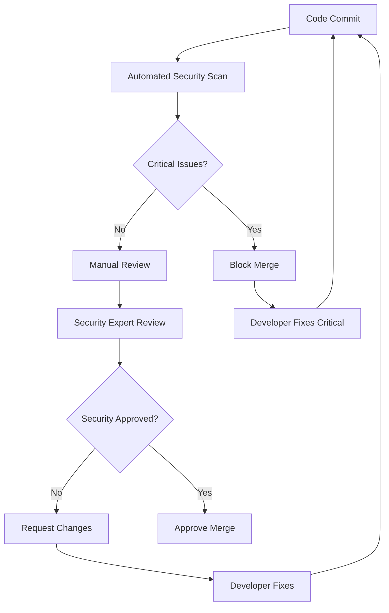

# Secure Code Review: {{project_type}} ({{programming_language}})

**Security Level:** {{security_level}}  
**Compliance:** {{compliance_framework}}  
**Review Scope:** {{review_scope}}  
**Team Size:** {{team_size}}

## 1. Pre-Review Setup & Tools

### Static Analysis Tools Configuration
```yaml
# Security-focused static analysis setup
static_analysis_tools:
{{#if (eq programming_language "javascript")}}
  eslint:
    extends:
      - "eslint:recommended"
      - "@eslint/js/recommended"
      - "plugin:security/recommended"
    plugins:
      - "security"
    rules:
      security/detect-object-injection: error
      security/detect-non-literal-regexp: error
      security/detect-unsafe-regex: error
      security/detect-buffer-noassert: error
      security/detect-child-process: error
      security/detect-disable-mustache-escape: error
      security/detect-eval-with-expression: error
      security/detect-no-csrf-before-method-override: error
      security/detect-non-literal-fs-filename: error
      security/detect-non-literal-require: error
      security/detect-possible-timing-attacks: error
      security/detect-pseudoRandomBytes: error
  
  semgrep:
    config: "p/owasp-top-ten"
    rules:
      - "p/javascript"
      - "p/nodejs"
      - "p/react"
    
  sonarjs:
    rules:
      - "S2068" # Credentials should not be hard-coded
      - "S2083" # I/O function calls should not be vulnerable to path injection attacks
      - "S2631" # Regular expressions should not be vulnerable to Denial of Service attacks
      - "S3649" # Database queries should not be vulnerable to injection attacks
      - "S4830" # Server certificates should be verified during SSL/TLS connections
{{/if}}

{{#if (eq programming_language "python")}}
  bandit:
    config:
      tests:
        - B101  # Test for use of assert
        - B102  # Test for exec used
        - B103  # Test for set_bad_file_permissions
        - B104  # Test for hardcoded_bind_all_interfaces
        - B105  # Test for hardcoded_password_string
        - B106  # Test for hardcoded_password_funcarg
        - B107  # Test for hardcoded_password_default
        - B108  # Test for insecure_ssl_tls
        - B110  # Test for try_except_pass
        - B112  # Test for try_except_continue
        - B201  # Test for flask_debug_true
        - B301  # Test for pickle
        - B302  # Test for marshal
        - B303  # Test for md5
        - B304  # Test for insecure_ciphers
        - B305  # Test for cipher_modes
        - B306  # Test for mktemp_q
        - B307  # Test for eval
        - B308  # Test for mark_safe
        - B309  # Test for httpsconnection
        - B310  # Test for urllib_urlopen
        - B311  # Test for random
        - B312  # Test for telnetlib
        - B313  # Test for xml_bad_cElementTree
        - B314  # Test for xml_bad_ElementTree
        - B315  # Test for xml_bad_expatreader
        - B316  # Test for xml_bad_expatbuilder
        - B317  # Test for xml_bad_sax
        - B318  # Test for xml_bad_minidom
        - B319  # Test for xml_bad_pulldom
        - B320  # Test for xml_bad_etree
        - B321  # Test for ftplib
        - B322  # Test for input
        - B323  # Test for unverified_context
        - B324  # Test for hashlib_new_insecure_functions
        - B325  # Test for tempnam
        - B501  # Test for request_with_no_cert_validation
        - B502  # Test for ssl_with_bad_version
        - B503  # Test for ssl_with_bad_defaults
        - B504  # Test for ssl_with_no_version
        - B505  # Test for weak_cryptographic_key
        - B506  # Test for yaml_load
        - B507  # Test for ssh_no_host_key_verification
        - B601  # Test for paramiko_calls
        - B602  # Test for subprocess_popen_with_shell_equals_true
        - B603  # Test for subprocess_without_shell_equals_true
        - B604  # Test for any_other_function_with_shell_equals_true
        - B605  # Test for start_process_with_a_shell
        - B606  # Test for start_process_with_no_shell
        - B607  # Test for start_process_with_partial_path
        - B608  # Test for hardcoded_sql_expressions
        - B609  # Test for linux_commands_wildcard_injection
        - B610  # Test for django_extra_used
        - B611  # Test for django_rawsql_used
        - B701  # Test for jinja2_autoescape_false
        - B702  # Test for use_of_mako_templates
        - B703  # Test for django_mark_safe
  
  semgrep:
    config: "p/owasp-top-ten"
    rules:
      - "p/python"
      - "p/django"
      - "p/flask"
  
  safety:
    # Check for known security vulnerabilities in dependencies
    full_report: true
    json: true
{{/if}}

{{#if (eq programming_language "java")}}
  spotbugs:
    plugins:
      - "find-sec-bugs"
    rules:
      - "COMMAND_INJECTION"
      - "SQL_INJECTION"
      - "LDAP_INJECTION"
      - "XPATH_INJECTION"
      - "XXE_XMLSTREAMREADER"
      - "XXE_DOCUMENT"
      - "XXE_SAXPARSER"
      - "TRUST_BOUNDARY_VIOLATION"
      - "WEAK_RANDOM"
      - "PREDICTABLE_RANDOM"
      - "HARD_CODE_PASSWORD"
      - "HARD_CODE_KEY"
      - "WEAK_HASH"
      - "WEAK_CIPHER"
      - "STATIC_IV"
      - "ECB_MODE"
      - "NULL_CIPHER"
      - "UNENCRYPTED_SOCKET"
      - "WEAK_HOSTNAME_VERIFIER"
      - "WEAK_TRUST_MANAGER"
  
  semgrep:
    config: "p/owasp-top-ten"
    rules:
      - "p/java"
      - "p/spring"
  
  sonarjava:
    rules:
      - "S2070" # SHA-1 and Message-Digest hash algorithms should not be used
      - "S2077" # Formatting SQL queries is security-sensitive
      - "S2078" # LDAP queries should not be vulnerable to injection attacks
      - "S2083" # I/O function calls should not be vulnerable to path injection attacks
      - "S2245" # Using pseudorandom number generators (PRNGs) is security-sensitive
      - "S2257" # Using non-standard cryptographic algorithms is security-sensitive
      - "S2647" # Basic authentication should not be used
      - "S4790" # Using weak hashing algorithms is security-sensitive
      - "S4830" # Server certificates should be verified during SSL/TLS connections
{{/if}}
```

### Automated Security Scanning Pipeline
```bash
#!/bin/bash
# Comprehensive security scanning script

set -e

PROJECT_ROOT="."
REPORT_DIR="security-reports"
DATE=$(date +%Y%m%d_%H%M%S)

# Create reports directory
mkdir -p "$REPORT_DIR"

echo "🔍 Starting security code review for {{project_type}} ({{programming_language}})..."

{{#if (eq programming_language "javascript")}}
# JavaScript/Node.js specific scans
echo "📊 Running ESLint security scan..."
npx eslint . --ext .js,.jsx,.ts,.tsx --format json --output-file "$REPORT_DIR/eslint-security-$DATE.json" || true

echo "🔍 Running Semgrep scan..."
semgrep --config=p/owasp-top-ten --config=p/javascript --config=p/nodejs --json --output "$REPORT_DIR/semgrep-$DATE.json" .

echo "📦 Checking npm audit..."
npm audit --audit-level moderate --json > "$REPORT_DIR/npm-audit-$DATE.json" || true

echo "🔐 Running retire.js for vulnerable dependencies..."
retire --outputformat json --outputpath "$REPORT_DIR/retire-$DATE.json" || true
{{/if}}

{{#if (eq programming_language "python")}}
# Python specific scans
echo "🐍 Running Bandit security scan..."
bandit -r . -f json -o "$REPORT_DIR/bandit-$DATE.json" || true

echo "🔍 Running Semgrep scan..."
semgrep --config=p/owasp-top-ten --config=p/python --json --output "$REPORT_DIR/semgrep-$DATE.json" .

echo "🛡️ Running Safety check for vulnerable dependencies..."
safety check --json --output "$REPORT_DIR/safety-$DATE.json" || true

echo "📊 Running Pylint security checks..."
pylint --load-plugins=pylint.extensions.docparams --output-format=json . > "$REPORT_DIR/pylint-$DATE.json" || true
{{/if}}

{{#if (eq programming_language "java")}}
# Java specific scans
echo "☕ Running SpotBugs with Find Security Bugs..."
mvn spotbugs:spotbugs -Dspotbugs.xmlOutput=true -Dspotbugs.xmlOutputDirectory="$REPORT_DIR" || true

echo "🔍 Running Semgrep scan..."
semgrep --config=p/owasp-top-ten --config=p/java --json --output "$REPORT_DIR/semgrep-$DATE.json" .

echo "📊 Running OWASP Dependency Check..."
mvn org.owasp:dependency-check-maven:check -Dformat=JSON -DoutputDirectory="$REPORT_DIR" || true
{{/if}}

# Language-agnostic scans
echo "🔑 Scanning for secrets and credentials..."
truffleHog --json --output "$REPORT_DIR/truffleHog-$DATE.json" . || true

echo "🔐 Running GitLeaks scan..."
gitleaks detect --report-path "$REPORT_DIR/gitleaks-$DATE.json" --report-format json || true

echo "📁 Scanning for sensitive files..."
find . -type f \( -name "*.pem" -o -name "*.key" -o -name "*.p12" -o -name "*.jks" -o -name ".env" -o -name "config.json" -o -name "secrets.yml" \) -not -path "./node_modules/*" -not -path "./.git/*" > "$REPORT_DIR/sensitive-files-$DATE.txt" || true

echo "✅ Security scans completed. Reports saved in $REPORT_DIR"
echo "📋 Generating consolidated report..."

# Generate consolidated HTML report
node generate-security-report.js "$REPORT_DIR" "$DATE"

echo "🎉 Security code review complete!"
```

## 2. Manual Code Review Checklist

### {{compliance_framework}} Security Requirements

{{#if (eq compliance_framework "OWASP")}}
#### OWASP Top 10 Manual Review Points

**A01: Broken Access Control**
- [ ] Verify proper authorization checks on all endpoints
- [ ] Check for horizontal privilege escalation vulnerabilities
- [ ] Ensure vertical privilege escalation prevention
- [ ] Review direct object references for access control
- [ ] Validate CORS configuration
- [ ] Check for missing function-level access controls

```{{programming_language}}
{{#if (eq programming_language "javascript")}}
// ❌ Bad: Missing authorization check
app.get('/api/users/:id/profile', (req, res) => {
  const user = getUserById(req.params.id);
  res.json(user);
});

// ✅ Good: Proper authorization
app.get('/api/users/:id/profile', authenticateToken, (req, res) => {
  // Check if user can access this profile
  if (req.user.id !== req.params.id && !req.user.roles.includes('admin')) {
    return res.status(403).json({ error: 'Access denied' });
  }
  
  const user = getUserById(req.params.id);
  res.json(user);
});
{{/if}}

{{#if (eq programming_language "python")}}
# ❌ Bad: Missing authorization check
@app.route('/api/users/<int:user_id>/profile')
def get_user_profile(user_id):
    user = User.query.get(user_id)
    return jsonify(user.to_dict())

# ✅ Good: Proper authorization
@app.route('/api/users/<int:user_id>/profile')
@token_required
def get_user_profile(current_user, user_id):
    # Check if user can access this profile
    if current_user.id != user_id and 'admin' not in current_user.roles:
        return jsonify({'error': 'Access denied'}), 403
    
    user = User.query.get(user_id)
    return jsonify(user.to_dict())
{{/if}}

{{#if (eq programming_language "java")}}
// ❌ Bad: Missing authorization check
@GetMapping("/api/users/{id}/profile")
public ResponseEntity<User> getUserProfile(@PathVariable Long id) {
    User user = userService.findById(id);
    return ResponseEntity.ok(user);
}

// ✅ Good: Proper authorization
@GetMapping("/api/users/{id}/profile")
@PreAuthorize("#id == authentication.principal.id or hasRole('ADMIN')")
public ResponseEntity<User> getUserProfile(@PathVariable Long id) {
    User user = userService.findById(id);
    return ResponseEntity.ok(user);
}
{{/if}}
```

**A02: Cryptographic Failures**
- [ ] Review encryption algorithms (AES-256, RSA-2048+)
- [ ] Check for hardcoded cryptographic keys
- [ ] Verify proper key management practices
- [ ] Ensure sensitive data encryption at rest
- [ ] Validate TLS configuration
- [ ] Review password hashing algorithms (bcrypt/scrypt/Argon2)

**A03: Injection**
- [ ] SQL injection prevention (parameterized queries)
- [ ] NoSQL injection protection
- [ ] Command injection prevention
- [ ] LDAP injection protection
- [ ] XPath injection prevention
- [ ] Template injection prevention

```{{programming_language}}
{{#if (eq programming_language "javascript")}}
// ❌ Bad: SQL injection vulnerability
const query = `SELECT * FROM users WHERE email = '${email}'`;
db.query(query, callback);

// ✅ Good: Parameterized query
const query = 'SELECT * FROM users WHERE email = ?';
db.query(query, [email], callback);

// ❌ Bad: Command injection
const { exec } = require('child_process');
exec(`ls ${userInput}`, callback);

// ✅ Good: Input validation and safer approach
const path = require('path');
const fs = require('fs');

if (!/^[a-zA-Z0-9_-]+$/.test(userInput)) {
  throw new Error('Invalid input');
}

const safePath = path.join('/safe/directory', userInput);
fs.readdir(safePath, callback);
{{/if}}

{{#if (eq programming_language "python")}}
# ❌ Bad: SQL injection vulnerability
query = f"SELECT * FROM users WHERE email = '{email}'"
cursor.execute(query)

# ✅ Good: Parameterized query
query = "SELECT * FROM users WHERE email = %s"
cursor.execute(query, (email,))

# ❌ Bad: Command injection
import subprocess
subprocess.run(f"ls {user_input}", shell=True)

# ✅ Good: Input validation and safer approach
import subprocess
import re
import os

if not re.match(r'^[a-zA-Z0-9_-]+$', user_input):
    raise ValueError('Invalid input')

safe_path = os.path.join('/safe/directory', user_input)
subprocess.run(['ls', safe_path], check=True)
{{/if}}

{{#if (eq programming_language "java")}}
// ❌ Bad: SQL injection vulnerability
String query = "SELECT * FROM users WHERE email = '" + email + "'";
statement.executeQuery(query);

// ✅ Good: Prepared statement
String query = "SELECT * FROM users WHERE email = ?";
PreparedStatement stmt = connection.prepareStatement(query);
stmt.setString(1, email);
ResultSet rs = stmt.executeQuery();

// ❌ Bad: Command injection
Runtime.getRuntime().exec("ls " + userInput);

// ✅ Good: Input validation and safer approach
if (!userInput.matches("^[a-zA-Z0-9_-]+$")) {
    throw new IllegalArgumentException("Invalid input");
}

ProcessBuilder pb = new ProcessBuilder("ls", "/safe/directory/" + userInput);
Process process = pb.start();
{{/if}}
```
{{/if}}

### Language-Specific Security Patterns

{{#if (eq programming_language "javascript")}}
#### JavaScript/Node.js Security Review Points

**Prototype Pollution**
```javascript
// ❌ Bad: Vulnerable to prototype pollution
function merge(target, source) {
  for (let key in source) {
    target[key] = source[key];
  }
  return target;
}

// ✅ Good: Safe merge implementation
function safeMerge(target, source) {
  for (let key in source) {
    if (source.hasOwnProperty(key) && key !== '__proto__' && key !== 'constructor' && key !== 'prototype') {
      if (typeof source[key] === 'object' && source[key] !== null) {
        target[key] = safeMerge(target[key] || {}, source[key]);
      } else {
        target[key] = source[key];
      }
    }
  }
  return target;
}
```

**ReDoS (Regular Expression Denial of Service)**
```javascript
// ❌ Bad: Vulnerable to ReDoS
const emailRegex = /^([a-zA-Z0-9_\.-])+@([a-zA-Z0-9_\.-])+\.([a-zA-Z])+([a-zA-Z])+$/;

// ✅ Good: Safe regex pattern
const emailRegex = /^[a-zA-Z0-9._%+-]+@[a-zA-Z0-9.-]+\.[a-zA-Z]{2,}$/;

// Use regex timeout for complex patterns
const validator = require('validator');
if (validator.isEmail(email)) {
  // Email is valid
}
```

**Server-Side Request Forgery (SSRF)**
```javascript
// ❌ Bad: SSRF vulnerability
app.post('/fetch-url', (req, res) => {
  const url = req.body.url;
  fetch(url)
    .then(response => response.text())
    .then(data => res.send(data));
});

// ✅ Good: URL validation and allowlist
const url = require('url');
const ALLOWED_HOSTS = ['api.example.com', 'trusted-service.com'];

app.post('/fetch-url', (req, res) => {
  const requestedUrl = req.body.url;
  
  try {
    const parsedUrl = new URL(requestedUrl);
    
    // Check protocol
    if (!['http:', 'https:'].includes(parsedUrl.protocol)) {
      return res.status(400).json({ error: 'Invalid protocol' });
    }
    
    // Check hostname against allowlist
    if (!ALLOWED_HOSTS.includes(parsedUrl.hostname)) {
      return res.status(400).json({ error: 'Host not allowed' });
    }
    
    // Additional checks for private IP ranges
    if (isPrivateIP(parsedUrl.hostname)) {
      return res.status(400).json({ error: 'Private IPs not allowed' });
    }
    
    fetch(requestedUrl, { timeout: 5000 })
      .then(response => response.text())
      .then(data => res.send(data))
      .catch(err => res.status(500).json({ error: 'Fetch failed' }));
      
  } catch (error) {
    return res.status(400).json({ error: 'Invalid URL' });
  }
});
```
{{/if}}

{{#if (eq programming_language "python")}}
#### Python Security Review Points

**Pickle Deserialization**
```python
# ❌ Bad: Unsafe pickle deserialization
import pickle

def load_data(data):
    return pickle.loads(data)  # Dangerous!

# ✅ Good: Use safe serialization
import json

def load_data(data):
    try:
        return json.loads(data)
    except json.JSONDecodeError:
        raise ValueError("Invalid JSON data")

# For complex objects, use safe alternatives
import jsonpickle
jsonpickle.set_encoder_options('json', ensure_ascii=False)
```

**Template Injection**
```python
# ❌ Bad: Template injection vulnerability
from jinja2 import Template

def render_template(template_string, context):
    template = Template(template_string)  # User input as template!
    return template.render(context)

# ✅ Good: Use predefined templates
from jinja2 import Environment, FileSystemLoader, select_autoescape

env = Environment(
    loader=FileSystemLoader('templates'),
    autoescape=select_autoescape(['html', 'xml'])
)

def render_template(template_name, context):
    template = env.get_template(template_name)
    return template.render(context)
```

**XML External Entity (XXE)**
```python
# ❌ Bad: XXE vulnerability
import xml.etree.ElementTree as ET

def parse_xml(xml_data):
    root = ET.fromstring(xml_data)  # Vulnerable to XXE
    return root

# ✅ Good: Safe XML parsing
import defusedxml.ElementTree as ET
from defusedxml import defuse_stdlib

defuse_stdlib()  # Monkey-patch stdlib

def parse_xml(xml_data):
    try:
        root = ET.fromstring(xml_data)
        return root
    except ET.ParseError as e:
        raise ValueError(f"Invalid XML: {e}")
```
{{/if}}

{{#if (eq programming_language "java")}}
#### Java Security Review Points

**Deserialization Attacks**
```java
// ❌ Bad: Unsafe deserialization
public Object deserialize(byte[] data) {
    try (ObjectInputStream ois = new ObjectInputStream(new ByteArrayInputStream(data))) {
        return ois.readObject(); // Dangerous!
    } catch (Exception e) {
        throw new RuntimeException(e);
    }
}

// ✅ Good: Safe deserialization with validation
public Object safeDeserialize(byte[] data, Set<String> allowedClasses) {
    try (ObjectInputStream ois = new ObjectInputStream(new ByteArrayInputStream(data)) {
        @Override
        protected Class<?> resolveClass(ObjectStreamClass desc) throws IOException, ClassNotFoundException {
            if (!allowedClasses.contains(desc.getName())) {
                throw new ClassNotFoundException("Class not allowed: " + desc.getName());
            }
            return super.resolveClass(desc);
        }
    }) {
        return ois.readObject();
    } catch (Exception e) {
        throw new RuntimeException(e);
    }
}
```

**Path Traversal**
```java
// ❌ Bad: Path traversal vulnerability
public String readFile(String filename) throws IOException {
    File file = new File("/uploads/" + filename);
    return Files.readString(file.toPath());
}

// ✅ Good: Safe file access
public String readFile(String filename) throws IOException {
    // Validate filename
    if (filename.contains("..") || filename.contains("/") || filename.contains("\\")) {
        throw new IllegalArgumentException("Invalid filename");
    }
    
    Path basePath = Paths.get("/uploads").toAbsolutePath().normalize();
    Path filePath = basePath.resolve(filename).normalize();
    
    // Ensure the resolved path is still within the base directory
    if (!filePath.startsWith(basePath)) {
        throw new IllegalArgumentException("Path traversal attempt detected");
    }
    
    return Files.readString(filePath);
}
```

**XML External Entity (XXE)**
```java
// ❌ Bad: XXE vulnerability
public Document parseXml(String xml) throws Exception {
    DocumentBuilderFactory factory = DocumentBuilderFactory.newInstance();
    DocumentBuilder builder = factory.newDocumentBuilder();
    return builder.parse(new ByteArrayInputStream(xml.getBytes()));
}

// ✅ Good: Secure XML parsing
public Document parseXml(String xml) throws Exception {
    DocumentBuilderFactory factory = DocumentBuilderFactory.newInstance();
    
    // Disable external entities
    factory.setFeature("http://apache.org/xml/features/disallow-doctype-decl", true);
    factory.setFeature("http://xml.org/sax/features/external-general-entities", false);
    factory.setFeature("http://xml.org/sax/features/external-parameter-entities", false);
    factory.setFeature("http://apache.org/xml/features/nonvalidating/load-external-dtd", false);
    factory.setXIncludeAware(false);
    factory.setExpandEntityReferences(false);
    
    DocumentBuilder builder = factory.newDocumentBuilder();
    return builder.parse(new ByteArrayInputStream(xml.getBytes()));
}
```
{{/if}}

## 3. Security Code Review Process

### Review Workflow


### Review Checklist Template
```markdown
# Security Code Review Checklist

## Automated Scan Results
- [ ] Static analysis tools passed
- [ ] Dependency vulnerability scan clear
- [ ] Secret detection scan clean
- [ ] License compliance verified

## Manual Review Points

### Authentication & Authorization
- [ ] Proper authentication mechanisms
- [ ] Authorization checks on all endpoints
- [ ] Session management security
- [ ] Password policy compliance
- [ ] Multi-factor authentication support

### Input Validation
- [ ] All inputs validated and sanitized
- [ ] SQL injection prevention
- [ ] XSS prevention
- [ ] Command injection prevention
- [ ] File upload security

### Cryptography
- [ ] Strong encryption algorithms used
- [ ] Proper key management
- [ ] Secure random number generation
- [ ] Certificate validation
- [ ] TLS configuration

### Error Handling
- [ ] No sensitive data in error messages
- [ ] Proper exception handling
- [ ] Logging security events
- [ ] Rate limiting implemented

### Data Protection
- [ ] Sensitive data encryption
- [ ] PII handling compliance
- [ ] Data retention policies
- [ ] Secure data transmission

### Security Headers
- [ ] HTTPS enforcement
- [ ] Content Security Policy
- [ ] CSRF protection
- [ ] Clickjacking prevention

## {{compliance_framework}} Compliance
{{#if (eq compliance_framework "OWASP")}}
- [ ] OWASP Top 10 risks addressed
- [ ] Security controls implemented
- [ ] Threat modeling completed
{{/if}}

## Risk Assessment
- Risk Level: [ ] Low [ ] Medium [ ] High [ ] Critical
- Security Impact: [ ] None [ ] Minor [ ] Major [ ] Severe
- Compliance Impact: [ ] None [ ] Minor [ ] Major [ ] Severe

## Reviewer Decision
- [ ] Approve
- [ ] Approve with conditions
- [ ] Request changes
- [ ] Reject

**Reviewer:** [Name]
**Date:** [Date]
**Comments:** [Additional comments]
```

## 4. Vulnerability Assessment Matrix

### Risk Scoring System
```python
# Security vulnerability risk assessment
class SecurityRiskAssessment:
    LIKELIHOOD_SCORES = {
        'very_low': 1,
        'low': 2,
        'medium': 3,
        'high': 4,
        'very_high': 5
    }
    
    IMPACT_SCORES = {
        'minimal': 1,
        'minor': 2,
        'moderate': 3,
        'major': 4,
        'severe': 5
    }
    
    def calculate_risk_score(self, likelihood, impact, exploitability=1.0):
        """Calculate CVSS-like risk score"""
        likelihood_score = self.LIKELIHOOD_SCORES.get(likelihood, 3)
        impact_score = self.IMPACT_SCORES.get(impact, 3)
        
        # Base score calculation
        base_score = (likelihood_score * impact_score * exploitability) / 5
        
        # Normalize to 0-10 scale
        risk_score = min(10, base_score)
        
        if risk_score >= 9.0:
            return 'Critical'
        elif risk_score >= 7.0:
            return 'High'
        elif risk_score >= 4.0:
            return 'Medium'
        else:
            return 'Low'
    
    def assess_vulnerability(self, vuln_type, context):
        """Assess specific vulnerability types"""
        assessments = {
            'sql_injection': {
                'likelihood': 'high',
                'impact': 'severe',
                'exploitability': 1.0
            },
            'xss': {
                'likelihood': 'medium',
                'impact': 'moderate',
                'exploitability': 0.8
            },
            'csrf': {
                'likelihood': 'medium',
                'impact': 'moderate',
                'exploitability': 0.7
            },
            'xxe': {
                'likelihood': 'low',
                'impact': 'major',
                'exploitability': 0.6
            },
            'deserialization': {
                'likelihood': 'low',
                'impact': 'severe',
                'exploitability': 0.9
            },
            'broken_access_control': {
                'likelihood': 'high',
                'impact': 'major',
                'exploitability': 0.9
            }
        }
        
        if vuln_type in assessments:
            assessment = assessments[vuln_type]
            return self.calculate_risk_score(
                assessment['likelihood'],
                assessment['impact'],
                assessment['exploitability']
            )
        
        return 'Unknown'
```

## 5. Remediation Guidelines

### Critical Severity Issues (Fix Immediately)
```yaml
critical_issues:
  sql_injection:
    priority: 1
    timeline: "24 hours"
    actions:
      - "Stop deployment pipeline"
      - "Use parameterized queries"
      - "Input validation"
      - "Penetration test after fix"
  
  remote_code_execution:
    priority: 1
    timeline: "24 hours"
    actions:
      - "Immediate patch"
      - "Disable affected functionality"
      - "Security incident response"
      - "Full system audit"
  
  authentication_bypass:
    priority: 1
    timeline: "24 hours"
    actions:
      - "Force user re-authentication"
      - "Revoke all sessions"
      - "Fix authentication logic"
      - "Audit access logs"
```

### High Severity Issues (Fix within 1 week)
```yaml
high_issues:
  xss_vulnerabilities:
    priority: 2
    timeline: "1 week"
    actions:
      - "Output encoding"
      - "Content Security Policy"
      - "Input sanitization"
      - "Security testing"
  
  broken_access_control:
    priority: 2
    timeline: "1 week"
    actions:
      - "Implement proper authorization"
      - "Role-based access control"
      - "Access control testing"
      - "Audit logs review"
```

### Medium Severity Issues (Fix within 1 month)
```yaml
medium_issues:
  weak_cryptography:
    priority: 3
    timeline: "1 month"
    actions:
      - "Upgrade encryption algorithms"
      - "Key rotation procedures"
      - "Certificate management"
      - "Crypto audit"
  
  information_disclosure:
    priority: 3
    timeline: "1 month"
    actions:
      - "Error message sanitization"
      - "Debug information removal"
      - "Security headers"
      - "Information leakage testing"
```

## 6. Security Testing Integration

### CI/CD Pipeline Integration
```yaml
# .github/workflows/security-review.yml
name: Security Code Review

on:
  pull_request:
    branches: [ main, develop ]
  push:
    branches: [ main ]

jobs:
  security-scan:
    runs-on: ubuntu-latest
    
    steps:
    - uses: actions/checkout@v3
      with:
        fetch-depth: 0
    
    - name: Setup {{programming_language}} environment
      uses: actions/setup-node@v3  # Adjust based on language
      with:
        node-version: '18'
    
    - name: Install dependencies
      run: npm install
    
    - name: Run static security analysis
      run: |
        npm run security:scan
        npm run security:dependencies
    
    - name: Run Semgrep
      uses: returntocorp/semgrep-action@v1
      with:
        config: >
          p/owasp-top-ten
          p/{{programming_language}}
    
    - name: Upload security scan results
      uses: github/codeql-action/upload-sarif@v2
      if: always()
      with:
        sarif_file: security-results.sarif
    
    - name: Security review gate
      run: |
        if [ -f "security-issues.json" ]; then
          CRITICAL_COUNT=$(jq '.results[] | select(.severity == "CRITICAL") | length' security-issues.json)
          if [ "$CRITICAL_COUNT" -gt 0 ]; then
            echo "❌ Critical security issues found. Review required."
            exit 1
          fi
        fi
    
    - name: Generate security report
      run: |
        echo "## 🔒 Security Review Results" >> $GITHUB_STEP_SUMMARY
        echo "" >> $GITHUB_STEP_SUMMARY
        echo "**Project:** {{project_type}} ({{programming_language}})" >> $GITHUB_STEP_SUMMARY
        echo "**Security Level:** {{security_level}}" >> $GITHUB_STEP_SUMMARY
        echo "**Compliance:** {{compliance_framework}}" >> $GITHUB_STEP_SUMMARY
        echo "" >> $GITHUB_STEP_SUMMARY
        
        if [ -f "security-summary.md" ]; then
          cat security-summary.md >> $GITHUB_STEP_SUMMARY
        fi
```

## 7. Security Metrics & KPIs

### Security Code Review Metrics
```python
# Security metrics tracking
class SecurityMetrics:
    def __init__(self):
        self.metrics = {
            'reviews_completed': 0,
            'critical_issues_found': 0,
            'high_issues_found': 0,
            'medium_issues_found': 0,
            'low_issues_found': 0,
            'issues_resolved': 0,
            'average_resolution_time': 0,
            'security_debt_score': 0
        }
    
    def calculate_security_score(self):
        """Calculate overall security score (0-100)"""
        total_issues = (
            self.metrics['critical_issues_found'] * 4 +
            self.metrics['high_issues_found'] * 3 +
            self.metrics['medium_issues_found'] * 2 +
            self.metrics['low_issues_found'] * 1
        )
        
        if total_issues == 0:
            return 100
        
        resolved_weight = (
            self.metrics['issues_resolved'] / 
            (self.metrics['critical_issues_found'] + 
             self.metrics['high_issues_found'] + 
             self.metrics['medium_issues_found'] + 
             self.metrics['low_issues_found'])
        ) * 100
        
        return max(0, min(100, resolved_weight))
    
    def generate_dashboard(self):
        """Generate security metrics dashboard"""
        return {
            'security_score': self.calculate_security_score(),
            'total_reviews': self.metrics['reviews_completed'],
            'open_critical': self.metrics['critical_issues_found'],
            'open_high': self.metrics['high_issues_found'],
            'resolution_rate': self.calculate_resolution_rate(),
            'avg_resolution_time': self.metrics['average_resolution_time']
        }
```

## 8. Team Training & Best Practices

### Security Training Checklist
- [ ] OWASP Top 10 awareness training
- [ ] Secure coding practices for {{programming_language}}
- [ ] Threat modeling workshops
- [ ] Security testing methodologies
- [ ] Incident response procedures
- [ ] Compliance requirements ({{compliance_framework}})

### Code Review Best Practices
1. **Review Early and Often**
   - Security reviews on every pull request
   - Incremental reviews better than large batches
   - Automated tools as first line of defense

2. **Security-First Mindset**
   - Assume all input is malicious
   - Principle of least privilege
   - Defense in depth strategy

3. **Documentation Requirements**
   - Document security decisions
   - Maintain threat model updates
   - Record security exceptions with justification

## Conclusion

This secure code review framework provides comprehensive coverage for {{project_type}} applications built with {{programming_language}}. The combination of automated tools and manual review processes ensures thorough security validation while maintaining development velocity.

**Key Benefits:**
- Systematic vulnerability detection
- {{compliance_framework}} compliance validation
- Automated security testing integration
- Risk-based prioritization
- Continuous security improvement

**Success Metrics:**
- Zero critical vulnerabilities in production
- Mean time to remediation < {{#if (eq security_level "critical")}}24 hours{{else if (eq security_level "high")}}1 week{{else}}1 month{{/if}}
- Security score > 90%
- 100% code review coverage
- Team security training completion
