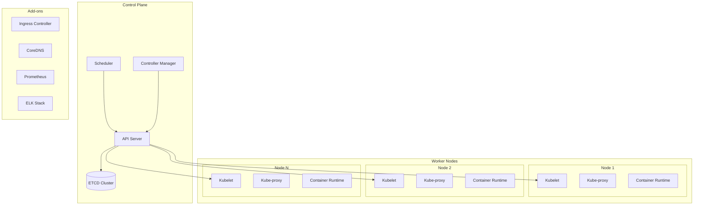

# Container Orchestration Strategy: {{application_architecture}}

**Environment:** {{environment_type}}  
**Cluster Size:** {{cluster_size}}  
**Workload Type:** {{workload_type}}  
**Provider:** {{cloud_provider}}  
**Scaling:** {{scaling_requirements}}

## 1. Architecture Overview



### Cluster Configuration
```yaml
# Cluster specification for {{cluster_size}} cluster
cluster_config:
  control_plane:
    replicas: {{#if (eq cluster_size "large")}}5{{else if (eq cluster_size "medium")}}3{{else}}1{{/if}}
    instance_type: {{#if (eq cloud_provider "aws")}}"m5.xlarge"{{else if (eq cloud_provider "azure")}}"Standard_D4s_v3"{{else if (eq cloud_provider "gcp")}}"n1-standard-4"{{else}}"4CPU/8GB"{{/if}}
    
  worker_nodes:
    min_nodes: {{#if (eq cluster_size "large")}}10{{else if (eq cluster_size "medium")}}3{{else}}2{{/if}}
    max_nodes: {{#if (eq cluster_size "large")}}100{{else if (eq cluster_size "medium")}}20{{else}}10{{/if}}
    instance_type: {{#if (eq cloud_provider "aws")}}"m5.large"{{else if (eq cloud_provider "azure")}}"Standard_D2s_v3"{{else if (eq cloud_provider "gcp")}}"n1-standard-2"{{else}}"2CPU/4GB"{{/if}}
    
  networking:
    cni: "Calico"  # or Flannel, Weave
    service_cidr: "10.96.0.0/12"
    pod_cidr: "10.244.0.0/16"
    
  storage:
    default_storage_class: {{#if (eq cloud_provider "aws")}}"gp3"{{else if (eq cloud_provider "azure")}}"managed-premium"{{else if (eq cloud_provider "gcp")}}"pd-ssd"{{else}}"local-storage"{{/if}}
    backup_strategy: "Velero"
```

## 2. {{application_architecture}} Deployment Patterns

{{#if (eq application_architecture "microservices")}}
### Microservices Orchestration
```yaml
# Service mesh configuration for microservices
apiVersion: v1
kind: Namespace
metadata:
  name: microservices
  labels:
    istio-injection: enabled
---
# Example microservice deployment
apiVersion: apps/v1
kind: Deployment
metadata:
  name: user-service
  namespace: microservices
spec:
  replicas: {{#if (eq scaling_requirements "auto-scaling")}}3{{else}}2{{/if}}
  selector:
    matchLabels:
      app: user-service
  template:
    metadata:
      labels:
        app: user-service
        version: v1
    spec:
      containers:
      - name: user-service
        image: user-service:latest
        ports:
        - containerPort: 8080
        env:
        - name: DATABASE_URL
          valueFrom:
            secretKeyRef:
              name: db-secret
              key: url
        resources:
          requests:
            memory: "256Mi"
            cpu: "250m"
          limits:
            memory: "512Mi"
            cpu: "500m"
        livenessProbe:
          httpGet:
            path: /health
            port: 8080
          initialDelaySeconds: 30
          periodSeconds: 10
        readinessProbe:
          httpGet:
            path: /ready
            port: 8080
          initialDelaySeconds: 5
          periodSeconds: 5
---
apiVersion: v1
kind: Service
metadata:
  name: user-service
  namespace: microservices
spec:
  selector:
    app: user-service
  ports:
  - port: 80
    targetPort: 8080
  type: ClusterIP
---
# Horizontal Pod Autoscaler
{{#if (includes scaling_requirements "auto-scaling")}}
apiVersion: autoscaling/v2
kind: HorizontalPodAutoscaler
metadata:
  name: user-service-hpa
  namespace: microservices
spec:
  scaleTargetRef:
    apiVersion: apps/v1
    kind: Deployment
    name: user-service
  minReplicas: 2
  maxReplicas: 20
  metrics:
  - type: Resource
    resource:
      name: cpu
      target:
        type: Utilization
        averageUtilization: 70
  - type: Resource
    resource:
      name: memory
      target:
        type: Utilization
        averageUtilization: 80
{{/if}}
```

### Service Mesh Configuration (Istio)
```yaml
# Istio configuration for microservices
apiVersion: networking.istio.io/v1beta1
kind: VirtualService
metadata:
  name: user-service-vs
  namespace: microservices
spec:
  hosts:
  - user-service
  http:
  - match:
    - headers:
        version:
          exact: v2
    route:
    - destination:
        host: user-service
        subset: v2
      weight: 100
  - route:
    - destination:
        host: user-service
        subset: v1
      weight: 90
    - destination:
        host: user-service
        subset: v2
      weight: 10
---
apiVersion: networking.istio.io/v1beta1
kind: DestinationRule
metadata:
  name: user-service-dr
  namespace: microservices
spec:
  host: user-service
  subsets:
  - name: v1
    labels:
      version: v1
  - name: v2
    labels:
      version: v2
  trafficPolicy:
    connectionPool:
      tcp:
        maxConnections: 100
      http:
        http1MaxPendingRequests: 50
        maxRequestsPerConnection: 10
    circuitBreaker:
      consecutiveErrors: 3
      interval: 30s
      baseEjectionTime: 30s
```
{{/if}}

{{#if (eq workload_type "batch-jobs")}}
### Batch Job Orchestration
```yaml
# Batch job configuration
apiVersion: batch/v1
kind: Job
metadata:
  name: data-processing-job
spec:
  parallelism: {{#if (eq cluster_size "large")}}10{{else if (eq cluster_size "medium")}}5{{else}}2{{/if}}
  completions: 100
  backoffLimit: 3
  template:
    spec:
      containers:
      - name: data-processor
        image: data-processor:latest
        command: ["python", "process_data.py"]
        env:
        - name: BATCH_SIZE
          value: "1000"
        - name: S3_BUCKET
          value: "data-processing-bucket"
        resources:
          requests:
            memory: "1Gi"
            cpu: "500m"
          limits:
            memory: "2Gi"
            cpu: "1000m"
        volumeMounts:
        - name: data-volume
          mountPath: /data
      volumes:
      - name: data-volume
        persistentVolumeClaim:
          claimName: data-pvc
      restartPolicy: OnFailure
---
# CronJob for scheduled processing
apiVersion: batch/v1
kind: CronJob
metadata:
  name: daily-data-processing
spec:
  schedule: "0 2 * * *"  # Daily at 2 AM
  jobTemplate:
    spec:
      template:
        spec:
          containers:
          - name: daily-processor
            image: data-processor:latest
            command: ["python", "daily_process.py"]
          restartPolicy: OnFailure
  successfulJobsHistoryLimit: 3
  failedJobsHistoryLimit: 1
```
{{/if}}

{{#if (eq workload_type "ai-ml")}}
### AI/ML Workload Configuration
```yaml
# GPU-enabled deployment for ML workloads
apiVersion: apps/v1
kind: Deployment
metadata:
  name: ml-inference-service
spec:
  replicas: {{#if (eq scaling_requirements "auto-scaling")}}2{{else}}1{{/if}}
  selector:
    matchLabels:
      app: ml-inference
  template:
    metadata:
      labels:
        app: ml-inference
    spec:
      nodeSelector:
        accelerator: nvidia-tesla-gpu
      containers:
      - name: ml-model
        image: ml-inference:latest
        ports:
        - containerPort: 8000
        resources:
          requests:
            memory: "4Gi"
            cpu: "2000m"
            nvidia.com/gpu: 1
          limits:
            memory: "8Gi"
            cpu: "4000m"
            nvidia.com/gpu: 1
        volumeMounts:
        - name: model-storage
          mountPath: /models
        env:
        - name: MODEL_PATH
          value: "/models/latest"
        - name: CUDA_VISIBLE_DEVICES
          value: "0"
      volumes:
      - name: model-storage
        persistentVolumeClaim:
          claimName: model-storage-pvc
---
# Persistent Volume for model storage
apiVersion: v1
kind: PersistentVolumeClaim
metadata:
  name: model-storage-pvc
spec:
  accessModes:
    - ReadWriteOnce
  resources:
    requests:
      storage: 100Gi
  storageClassName: {{#if (eq cloud_provider "aws")}}"gp3"{{else if (eq cloud_provider "azure")}}"managed-premium"{{else}}"fast-ssd"{{/if}}
```
{{/if}}

## 3. Scaling Strategy Implementation

{{#if (includes scaling_requirements "auto-scaling")}}
### Horizontal Pod Autoscaling (HPA)
```yaml
# Advanced HPA configuration
apiVersion: autoscaling/v2
kind: HorizontalPodAutoscaler
metadata:
  name: advanced-hpa
spec:
  scaleTargetRef:
    apiVersion: apps/v1
    kind: Deployment
    name: web-service
  minReplicas: {{#if (eq cluster_size "large")}}5{{else if (eq cluster_size "medium")}}3{{else}}2{{/if}}
  maxReplicas: {{#if (eq cluster_size "large")}}50{{else if (eq cluster_size "medium")}}20{{else}}10{{/if}}
  metrics:
  - type: Resource
    resource:
      name: cpu
      target:
        type: Utilization
        averageUtilization: 70
  - type: Resource
    resource:
      name: memory
      target:
        type: Utilization
        averageUtilization: 80
  - type: Pods
    pods:
      metric:
        name: http_requests_per_second
      target:
        type: AverageValue
        averageValue: "1000"
  behavior:
    scaleDown:
      stabilizationWindowSeconds: 300
      policies:
      - type: Percent
        value: 10
        periodSeconds: 60
    scaleUp:
      stabilizationWindowSeconds: 60
      policies:
      - type: Percent
        value: 50
        periodSeconds: 60
      - type: Pods
        value: 2
        periodSeconds: 60
      selectPolicy: Max
```

### Vertical Pod Autoscaling (VPA)
```yaml
# VPA for automatic resource optimization
apiVersion: autoscaling.k8s.io/v1
kind: VerticalPodAutoscaler
metadata:
  name: web-service-vpa
spec:
  targetRef:
    apiVersion: apps/v1
    kind: Deployment
    name: web-service
  updatePolicy:
    updateMode: "Auto"
  resourcePolicy:
    containerPolicies:
    - containerName: web-service
      maxAllowed:
        cpu: 2
        memory: 4Gi
      minAllowed:
        cpu: 100m
        memory: 128Mi
      controlledResources: ["cpu", "memory"]
```

### Cluster Autoscaling
```yaml
# Cluster Autoscaler configuration
apiVersion: apps/v1
kind: Deployment
metadata:
  name: cluster-autoscaler
  namespace: kube-system
spec:
  replicas: 1
  selector:
    matchLabels:
      app: cluster-autoscaler
  template:
    metadata:
      labels:
        app: cluster-autoscaler
    spec:
      containers:
      - image: k8s.gcr.io/autoscaling/cluster-autoscaler:v1.21.0
        name: cluster-autoscaler
        resources:
          limits:
            cpu: 100m
            memory: 300Mi
          requests:
            cpu: 100m
            memory: 300Mi
        command:
        - ./cluster-autoscaler
        - --v=4
        - --stderrthreshold=info
        - --cloud-provider={{cloud_provider}}
        - --skip-nodes-with-local-storage=false
        - --expander=least-waste
        - --node-group-auto-discovery=asg:tag={{#if (eq cloud_provider "aws")}}k8s.io/cluster-autoscaler/enabled,k8s.io/cluster-autoscaler/cluster-name{{else}}kubernetes.io/cluster/cluster-name{{/if}}
        - --balance-similar-node-groups
        - --scale-down-delay-after-add=10m
        - --scale-down-unneeded-time=10m
        - --max-node-provision-time=15m
        env:
        - name: AWS_REGION
          value: us-west-2
```
{{/if}}

{{#if (includes scaling_requirements "predictive")}}
### Predictive Scaling with Custom Metrics
```python
# Predictive scaling controller
import kubernetes
from kubernetes import client, config
import numpy as np
from sklearn.linear_model import LinearRegression
import pandas as pd
from datetime import datetime, timedelta

class PredictiveScaler:
    def __init__(self, namespace: str, deployment_name: str):
        config.load_incluster_config()
        self.apps_v1 = client.AppsV1Api()
        self.namespace = namespace
        self.deployment_name = deployment_name
        self.metrics_history = []
    
    def collect_metrics(self):
        """Collect current metrics for prediction"""
        # Get current replica count
        deployment = self.apps_v1.read_namespaced_deployment(
            name=self.deployment_name,
            namespace=self.namespace
        )
        current_replicas = deployment.status.replicas
        
        # Get resource utilization (simplified)
        cpu_usage = self.get_cpu_usage()
        memory_usage = self.get_memory_usage()
        request_rate = self.get_request_rate()
        
        metrics = {
            'timestamp': datetime.now(),
            'replicas': current_replicas,
            'cpu_usage': cpu_usage,
            'memory_usage': memory_usage,
            'request_rate': request_rate
        }
        
        self.metrics_history.append(metrics)
        
        # Keep only last 24 hours of data
        cutoff_time = datetime.now() - timedelta(hours=24)
        self.metrics_history = [
            m for m in self.metrics_history 
            if m['timestamp'] > cutoff_time
        ]
    
    def predict_scaling_need(self, prediction_horizon_minutes: int = 15):
        """Predict if scaling is needed"""
        if len(self.metrics_history) < 10:
            return None  # Not enough data
        
        df = pd.DataFrame(self.metrics_history)
        
        # Prepare features for prediction
        df['hour'] = df['timestamp'].dt.hour
        df['minute'] = df['timestamp'].dt.minute
        df['day_of_week'] = df['timestamp'].dt.dayofweek
        
        # Features and target
        features = ['hour', 'minute', 'day_of_week', 'cpu_usage', 'memory_usage']
        X = df[features].values
        y = df['request_rate'].values
        
        # Train model
        model = LinearRegression()
        model.fit(X, y)
        
        # Predict future load
        future_time = datetime.now() + timedelta(minutes=prediction_horizon_minutes)
        future_features = np.array([[
            future_time.hour,
            future_time.minute,
            future_time.weekday(),
            df['cpu_usage'].iloc[-1],  # Use last known values
            df['memory_usage'].iloc[-1]
        ]])
        
        predicted_load = model.predict(future_features)[0]
        current_load = df['request_rate'].iloc[-1]
        
        # Calculate recommended replicas
        if predicted_load > current_load * 1.5:
            return min(df['replicas'].iloc[-1] * 2, 20)  # Scale up
        elif predicted_load < current_load * 0.5:
            return max(df['replicas'].iloc[-1] // 2, 2)  # Scale down
        
        return None  # No scaling needed
    
    def apply_scaling(self, target_replicas: int):
        """Apply predicted scaling"""
        try:
            # Update deployment
            body = {'spec': {'replicas': target_replicas}}
            self.apps_v1.patch_namespaced_deployment(
                name=self.deployment_name,
                namespace=self.namespace,
                body=body
            )
            print(f"Scaled {self.deployment_name} to {target_replicas} replicas")
        except Exception as e:
            print(f"Failed to scale: {e}")
    
    def get_cpu_usage(self):
        # Implementation to get CPU usage from metrics server
        pass
    
    def get_memory_usage(self):
        # Implementation to get memory usage from metrics server
        pass
    
    def get_request_rate(self):
        # Implementation to get request rate from monitoring system
        pass
```
{{/if}}

## 4. Storage & Data Management

### Persistent Storage Strategy
```yaml
# Storage classes for different workload types
{{#if (eq cloud_provider "aws")}}
apiVersion: storage.k8s.io/v1
kind: StorageClass
metadata:
  name: fast-ssd
provisioner: ebs.csi.aws.com
parameters:
  type: gp3
  iops: "3000"
  throughput: "125"
  fsType: ext4
allowVolumeExpansion: true
volumeBindingMode: WaitForFirstConsumer
---
apiVersion: storage.k8s.io/v1
kind: StorageClass
metadata:
  name: high-iops
provisioner: ebs.csi.aws.com
parameters:
  type: io2
  iops: "10000"
  fsType: ext4
allowVolumeExpansion: true
volumeBindingMode: WaitForFirstConsumer
{{/if}}

{{#if (eq cloud_provider "azure")}}
apiVersion: storage.k8s.io/v1
kind: StorageClass
metadata:
  name: fast-ssd
provisioner: disk.csi.azure.com
parameters:
  skuName: Premium_LRS
  kind: managed
allowVolumeExpansion: true
volumeBindingMode: WaitForFirstConsumer
---
apiVersion: storage.k8s.io/v1
kind: StorageClass
metadata:
  name: ultra-disk
provisioner: disk.csi.azure.com
parameters:
  skuName: UltraSSD_LRS
  kind: managed
allowVolumeExpansion: true
volumeBindingMode: WaitForFirstConsumer
{{/if}}

# StatefulSet for database workloads
apiVersion: apps/v1
kind: StatefulSet
metadata:
  name: database-cluster
spec:
  serviceName: database-service
  replicas: 3
  selector:
    matchLabels:
      app: database
  template:
    metadata:
      labels:
        app: database
    spec:
      containers:
      - name: database
        image: postgres:13
        ports:
        - containerPort: 5432
        env:
        - name: POSTGRES_DB
          value: "appdb"
        - name: POSTGRES_USER
          valueFrom:
            secretKeyRef:
              name: db-secret
              key: username
        - name: POSTGRES_PASSWORD
          valueFrom:
            secretKeyRef:
              name: db-secret
              key: password
        volumeMounts:
        - name: database-storage
          mountPath: /var/lib/postgresql/data
        resources:
          requests:
            memory: "1Gi"
            cpu: "500m"
          limits:
            memory: "2Gi"
            cpu: "1000m"
  volumeClaimTemplates:
  - metadata:
      name: database-storage
    spec:
      accessModes: ["ReadWriteOnce"]
      storageClassName: fast-ssd
      resources:
        requests:
          storage: 100Gi
```

### Backup and Disaster Recovery
```yaml
# Velero backup configuration
apiVersion: velero.io/v1
kind: Schedule
metadata:
  name: daily-backup
spec:
  schedule: "0 1 * * *"  # Daily at 1 AM
  template:
    includedNamespaces:
    - production
    - staging
    excludedResources:
    - events
    - events.events.k8s.io
    storageLocation: default
    ttl: 720h0m0s  # 30 days
    snapshotVolumes: true
---
# Backup storage location
apiVersion: velero.io/v1
kind: BackupStorageLocation
metadata:
  name: default
spec:
  provider: {{#if (eq cloud_provider "aws")}}aws{{else if (eq cloud_provider "azure")}}azure{{else if (eq cloud_provider "gcp")}}gcp{{else}}aws{{/if}}
  objectStorage:
    bucket: {{#if (eq cloud_provider "aws")}}k8s-backup-bucket{{else if (eq cloud_provider "azure")}}k8sbackupcontainer{{else}}k8s-backup-bucket{{/if}}
    prefix: cluster-backups
  config:
    {{#if (eq cloud_provider "aws")}}
    region: us-west-2
    {{/if}}
    {{#if (eq cloud_provider "azure")}}
    resourceGroup: k8s-backups-rg
    storageAccount: k8sbackupstorage
    {{/if}}
```

## 5. Security & Network Policies

### Network Security
```yaml
# Network policies for microservices isolation
apiVersion: networking.k8s.io/v1
kind: NetworkPolicy
metadata:
  name: microservice-isolation
  namespace: production
spec:
  podSelector:
    matchLabels:
      tier: backend
  policyTypes:
  - Ingress
  - Egress
  ingress:
  - from:
    - namespaceSelector:
        matchLabels:
          name: production
    - podSelector:
        matchLabels:
          tier: frontend
    ports:
    - protocol: TCP
      port: 8080
  egress:
  - to:
    - namespaceSelector:
        matchLabels:
          name: production
    - podSelector:
        matchLabels:
          tier: database
    ports:
    - protocol: TCP
      port: 5432
  - to: []
    ports:
    - protocol: TCP
      port: 53
    - protocol: UDP
      port: 53
---
# Pod Security Policy
apiVersion: policy/v1beta1
kind: PodSecurityPolicy
metadata:
  name: restricted-psp
spec:
  privileged: false
  allowPrivilegeEscalation: false
  requiredDropCapabilities:
    - ALL
  volumes:
    - 'configMap'
    - 'emptyDir'
    - 'projected'
    - 'secret'
    - 'downwardAPI'
    - 'persistentVolumeClaim'
  runAsUser:
    rule: 'MustRunAsNonRoot'
  seLinux:
    rule: 'RunAsAny'
  fsGroup:
    rule: 'RunAsAny'
```

### RBAC Configuration
```yaml
# Role-based access control
apiVersion: rbac.authorization.k8s.io/v1
kind: ClusterRole
metadata:
  name: developer-role
rules:
- apiGroups: [""]
  resources: ["pods", "services", "configmaps", "secrets"]
  verbs: ["get", "list", "create", "update", "patch", "delete"]
- apiGroups: ["apps"]
  resources: ["deployments", "replicasets"]
  verbs: ["get", "list", "create", "update", "patch", "delete"]
- apiGroups: [""]
  resources: ["pods/log"]
  verbs: ["get", "list"]
---
apiVersion: rbac.authorization.k8s.io/v1
kind: ClusterRoleBinding
metadata:
  name: developer-binding
subjects:
- kind: User
  name: developer@company.com
  apiGroup: rbac.authorization.k8s.io
roleRef:
  kind: ClusterRole
  name: developer-role
  apiGroup: rbac.authorization.k8s.io
```

## 6. Monitoring & Observability

### Prometheus Monitoring Stack
```yaml
# Prometheus configuration
apiVersion: v1
kind: ConfigMap
metadata:
  name: prometheus-config
data:
  prometheus.yml: |
    global:
      scrape_interval: 15s
    scrape_configs:
    - job_name: 'kubernetes-pods'
      kubernetes_sd_configs:
      - role: pod
      relabel_configs:
      - source_labels: [__meta_kubernetes_pod_annotation_prometheus_io_scrape]
        action: keep
        regex: true
    - job_name: 'kubernetes-nodes'
      kubernetes_sd_configs:
      - role: node
    - job_name: 'kube-state-metrics'
      static_configs:
      - targets: ['kube-state-metrics:8080']
---
# Grafana dashboard for {{workload_type}}
apiVersion: v1
kind: ConfigMap
metadata:
  name: grafana-dashboard-{{workload_type}}
data:
  dashboard.json: |
    {
      "dashboard": {
        "title": "{{workload_type}} Monitoring",
        "panels": [
          {
            "title": "Pod CPU Usage",
            "type": "graph",
            "targets": [{
              "expr": "rate(container_cpu_usage_seconds_total[5m])",
              "legendFormat": "{{pod}}"
            }]
          },
          {
            "title": "Pod Memory Usage",
            "type": "graph",
            "targets": [{
              "expr": "container_memory_usage_bytes",
              "legendFormat": "{{pod}}"
            }]
          },
          {{#if (eq workload_type "web-services")}}
          {
            "title": "Request Rate",
            "type": "graph",
            "targets": [{
              "expr": "rate(http_requests_total[5m])",
              "legendFormat": "{{method}} {{status}}"
            }]
          },
          {
            "title": "Response Latency",
            "type": "graph",
            "targets": [{
              "expr": "histogram_quantile(0.95, rate(http_request_duration_seconds_bucket[5m]))",
              "legendFormat": "95th percentile"
            }]
          }
          {{/if}}
        ]
      }
    }
```

### Distributed Tracing
```yaml
# Jaeger deployment for distributed tracing
apiVersion: apps/v1
kind: Deployment
metadata:
  name: jaeger
spec:
  replicas: 1
  selector:
    matchLabels:
      app: jaeger
  template:
    metadata:
      labels:
        app: jaeger
    spec:
      containers:
      - name: jaeger
        image: jaegertracing/all-in-one:latest
        ports:
        - containerPort: 16686
        - containerPort: 14268
        env:
        - name: COLLECTOR_ZIPKIN_HTTP_PORT
          value: "9411"
        - name: SPAN_STORAGE_TYPE
          value: "elasticsearch"
        - name: ES_SERVER_URLS
          value: "http://elasticsearch:9200"
```

## 7. GitOps & CI/CD Integration

### ArgoCD Configuration
```yaml
# ArgoCD application for {{application_architecture}}
apiVersion: argoproj.io/v1alpha1
kind: Application
metadata:
  name: {{application_architecture}}-app
  namespace: argocd
spec:
  project: default
  source:
    repoURL: https://github.com/company/{{application_architecture}}-manifests
    targetRevision: HEAD
    path: overlays/{{environment_type}}
  destination:
    server: https://kubernetes.default.svc
    namespace: {{environment_type}}
  syncPolicy:
    automated:
      prune: true
      selfHeal: true
    syncOptions:
    - CreateNamespace=true
    retry:
      limit: 5
      backoff:
        duration: 5s
        factor: 2
        maxDuration: 3m
```

### Tekton Pipeline
```yaml
# Tekton pipeline for container builds
apiVersion: tekton.dev/v1beta1
kind: Pipeline
metadata:
  name: build-and-deploy
spec:
  params:
  - name: repo-url
    type: string
  - name: image-name
    type: string
  workspaces:
  - name: shared-data
  tasks:
  - name: fetch-source
    taskRef:
      name: git-clone
    workspaces:
    - name: output
      workspace: shared-data
    params:
    - name: url
      value: $(params.repo-url)
  
  - name: build-image
    taskRef:
      name: kaniko
    runAfter: ["fetch-source"]
    workspaces:
    - name: source
      workspace: shared-data
    params:
    - name: IMAGE
      value: $(params.image-name)
  
  - name: deploy-to-k8s
    taskRef:
      name: kubectl-deploy
    runAfter: ["build-image"]
    params:
    - name: image
      value: $(params.image-name)
    - name: namespace
      value: {{environment_type}}
```

## Conclusion

This container orchestration strategy provides:

**Key Features:**
- Scalable {{application_architecture}} deployment patterns
- {{scaling_requirements}} scaling implementation
- Comprehensive security and network policies
- Production-ready monitoring and observability
- GitOps-based deployment automation

**Scale & Performance:**
- Optimized for {{cluster_size}} clusters
- {{workload_type}} specific optimizations
- {{cloud_provider}} native integrations
- Multi-region deployment support

**Production Ready:**
- High availability and disaster recovery
- Security hardening and compliance
- Automated scaling and healing
- Comprehensive monitoring and alerting
- Infrastructure as Code approach